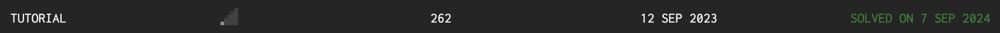
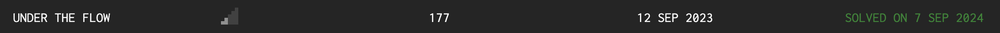
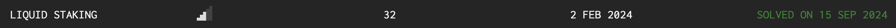

> 请在上边的 timezone 添加你的当地时区，这会有助于你的打卡状态的自动化更新，如果没有添加，默认为北京时间 UTC+8 时区
> 时区请参考以下列表，请移除 # 以后的内容

timezone: Pacific/Honolulu # 夏威夷-阿留申标准时间 (UTC-10)

timezone: America/Anchorage # 阿拉斯加标准时间 (UTC-9)

timezone: America/Los_Angeles # 太平洋标准时间 (UTC-8)

timezone: America/Denver # 山地标准时间 (UTC-7)

timezone: America/Chicago # 中部标准时间 (UTC-6)

timezone: America/New_York # 东部标准时间 (UTC-5)

timezone: America/Halifax # 大西洋标准时间 (UTC-4)

timezone: America/St_Johns # 纽芬兰标准时间 (UTC-3:30)

timezone: America/Sao_Paulo # 巴西利亚时间 (UTC-3)

timezone: Atlantic/Azores # 亚速尔群岛时间 (UTC-1)

timezone: Europe/London # 格林威治标准时间 (UTC+0)

timezone: Europe/Berlin # 中欧标准时间 (UTC+1)

timezone: Europe/Helsinki # 东欧标准时间 (UTC+2)

timezone: Europe/Moscow # 莫斯科标准时间 (UTC+3)

timezone: Asia/Dubai # 海湾标准时间 (UTC+4)

timezone: Asia/Kolkata # 印度标准时间 (UTC+5:30)

timezone: Asia/Dhaka # 孟加拉国标准时间 (UTC+6)

timezone: Asia/Bangkok # 中南半岛时间 (UTC+7)

timezone: Asia/Shanghai # 中国标准时间 (UTC+8)

timezone: Asia/Taipei # 台灣标准时间 (UTC+8)

timezone: Asia/Tokyo # 日本标准时间 (UTC+9)

timezone: Australia/Sydney # 澳大利亚东部标准时间 (UTC+10)

timezone: Pacific/Auckland # 新西兰标准时间 (UTC+12)

---

# Alex Liao

1. 自我介绍：我是 [Alex Liao](https://x.com/0xAlex_Liao)，目前為一名 Solidity 智能合約開發者，同時也會關注與學習 Web3 安全相關知識
2. 你认为你会完成本次残酷学习吗？ 希望可以，雖然有些題目感覺一天花兩小時也解不出來，但我會盡力抱助教大腿的。

## Notes

<!-- Content_START -->

### 2024.08.29

挑戰題目：

-   [damn-vulnerable-defi](https://www.damnvulnerabledefi.xyz/) - [Unstoppable](https://www.damnvulnerabledefi.xyz/challenges/unstoppable/)

筆記連結： [DamnVulnerableDeFi: Unstoppable](./Writeup/AlexLiao/DamnVulnerableDeFi/Unstoppable.md)

### 2024.08.30

挑戰題目：

-   [damn-vulnerable-defi](https://www.damnvulnerabledefi.xyz/) - [Naive Receiver](https://www.damnvulnerabledefi.xyz/challenges/naive-receiver/)

筆記連結： [DamnVulnerableDeFi: Naive Receiver](./Writeup/AlexLiao/DamnVulnerableDeFi/NaiveReceiver.md)

### 2024.08.31

挑戰題目：

-   [damn-vulnerable-defi](https://www.damnvulnerabledefi.xyz/) - [Truster](https://www.damnvulnerabledefi.xyz/challenges/truster/)

筆記連結： [DamnVulnerableDeFi: Truster](./Writeup/AlexLiao/DamnVulnerableDeFi/Truster.md)

### 2024.09.01

挑戰題目：

-   [damn-vulnerable-defi](https://www.damnvulnerabledefi.xyz/) - [Side Entrance](https://www.damnvulnerabledefi.xyz/challenges/side-entrance/)

筆記連結： [DamnVulnerableDeFi: Side Entrance](./Writeup/AlexLiao/DamnVulnerableDeFi/SideEntrance.md)

### 2024.09.02

挑戰題目：

-   [damn-vulnerable-defi](https://www.damnvulnerabledefi.xyz/) - [The Rewarder](https://www.damnvulnerabledefi.xyz/challenges/the-rewarder/)

筆記連結： [DamnVulnerableDeFi: The Rewarder](./Writeup/AlexLiao/DamnVulnerableDeFi/TheRewarder.md)

### 2024.09.03

挑戰題目：

-   [damn-vulnerable-defi](https://www.damnvulnerabledefi.xyz/) - [Selfie](https://www.damnvulnerabledefi.xyz/challenges/selfie/)

筆記連結： [DamnVulnerableDeFi: Selfie](./Writeup/AlexLiao/DamnVulnerableDeFi/Selfie.md)

### 2024.09.04

挑戰題目：

-   [damn-vulnerable-defi](https://www.damnvulnerabledefi.xyz/) - [Compromised](https://www.damnvulnerabledefi.xyz/challenges/compromised/)

筆記連結： [DamnVulnerableDeFi: Compromised](./Writeup/AlexLiao/DamnVulnerableDeFi/Compromised.md)

### 2024.09.05

挑戰題目：

-   [damn-vulnerable-defi](https://www.damnvulnerabledefi.xyz/) - [Puppet](https://www.damnvulnerabledefi.xyz/challenges/puppet/)

筆記連結： [DamnVulnerableDeFi: Puppet](./Writeup/AlexLiao/DamnVulnerableDeFi/Puppet.md)

### 2024.09.06

挑戰題目：

-   [damn-vulnerable-defi](https://www.damnvulnerabledefi.xyz/) - [Puppet V2](https://www.damnvulnerabledefi.xyz/challenges/puppet-v2/)

筆記連結： [DamnVulnerableDeFi: Puppet V2](./Writeup/AlexLiao/DamnVulnerableDeFi/PuppetV2.md)

### 2024.09.07

挑戰題目：

-   [damn-vulnerable-defi](https://www.damnvulnerabledefi.xyz/) - [Free Rider](https://www.damnvulnerabledefi.xyz/challenges/free-rider/)

-   [OnlyPwner](https://onlypwner.xyz/) - [FREEBIE](https://onlypwner.xyz/challenges/5)

-   [OnlyPwner](https://onlypwner.xyz/) - [TUTORIAL](https://onlypwner.xyz/challenges/1)

-   [OnlyPwner](https://onlypwner.xyz/) - [UNDER THE FLOW](https://onlypwner.xyz/challenges/9)

筆記連結： [DamnVulnerableDeFi: Free Rider](./Writeup/AlexLiao/DamnVulnerableDeFi/FreeRider.md)

> [!WARNING]
> OnlyPwner 不允許公開題目解法，僅提供完成截圖。





### 2024.09.08

挑戰題目：

-   [damn-vulnerable-defi](https://www.damnvulnerabledefi.xyz/) - [Backdoor](https://www.damnvulnerabledefi.xyz/challenges/backdoor/)

-   [OnlyPwner](https://onlypwner.xyz/) - [WRAPPED ETHER](https://onlypwner.xyz/challenges/12)

-   [OnlyPwner](https://onlypwner.xyz/) - [REVERSE RUGPULL](https://onlypwner.xyz/challenges/7)

筆記連結： [DamnVulnerableDeFi: Backdoor](./Writeup/AlexLiao/DamnVulnerableDeFi/Backdoor.md)

> [!WARNING]
> OnlyPwner 不允許公開題目解法，僅提供完成截圖。


### 2024.09.09

挑戰題目：

-   [damn-vulnerable-defi](https://www.damnvulnerabledefi.xyz/) - [Climber](https://www.damnvulnerabledefi.xyz/challenges/climber/)

筆記連結： [DamnVulnerableDeFi: Climber](./Writeup/AlexLiao/DamnVulnerableDeFi/Climber.md)

### 2024.09.10

挑戰題目：

-   [damn-vulnerable-defi](https://www.damnvulnerabledefi.xyz/) - [ABI Smuggling](https://www.damnvulnerabledefi.xyz/challenges/abi-smuggling/)

-   [OnlyPwner](https://onlypwner.xyz/) - [PLEASE SIGN HERE](https://onlypwner.xyz/challenges/6)

筆記連結： [DamnVulnerableDeFi: ABI Smuggling](./Writeup/AlexLiao/DamnVulnerableDeFi/ABISmuggling.md)

> [!WARNING]
> OnlyPwner 不允許公開題目解法，僅提供完成截圖。


### 2024.09.11

挑戰題目：

-   [ETH Taipei CTF 2023](https://github.com/dinngo/ETHTaipei-war-room/) - [HelloWorld](https://github.com/dinngo/ETHTaipei-war-room/blob/main/src/HelloWorld/HelloWorld.sol)

-   [ETH Taipei CTF 2023](https://github.com/dinngo/ETHTaipei-war-room/) - [Arcade](https://github.com/dinngo/ETHTaipei-war-room/blob/main/src/Arcade/Arcade.sol)

筆記連結： [ETH Taipei CTF 2023: HelloWorld](./Writeup/AlexLiao/ETHTaipeiCTF2023/HelloWorld.md)

筆記連結： [ETH Taipei CTF 2023: Arcade](./Writeup/AlexLiao/ETHTaipeiCTF2023/Arcade.md)

### 2024.09.12

挑戰題目：

-   [ETH Taipei CTF 2023](https://github.com/dinngo/ETHTaipei-war-room/) - [ETHTaipeiWarRoomNFT](https://github.com/dinngo/ETHTaipei-war-room/tree/main/src/E挑戰題目：

-   [ETH Taipei CTF 2023](https://github.com/dinngo/ETHTaipei-war-room/) - [Casino](https://github.com/dinngo/ETHTaipei-war-room/tree/main/src/Casino)

筆記連結： [ETH Taipei CTF 2023: Casino](./Writeup/AlexLiao/ETHTaipeiCTF2023/Casino.md)

### 2024.09.14THTaipeiWarRoomNFT)

筆記連結： [ETH Taipei CTF 2023: ETHTaipeiWarRoomNFT](./Writeup/AlexLiao/ETHTaipeiCTF2023/ETHTaipeiWarRoomNFT.md)

### 2024.09.13

挑戰題目：

-   [OnlyPwner](https://onlypwner.xyz/) - [ALL OR NOTHING](https://onlypwner.xyz/challenges/10)

> [!WARNING]
> OnlyPwner 不允許公開題目解法，僅提供完成截圖。


### 2024.09.15

挑戰題目：

-   [OnlyPwner](https://onlypwner.xyz/) - [LIQUID STAKING](https://onlypwner.xyz/challenges/15)

> [!WARNING]
> OnlyPwner 不允許公開題目解法，僅提供完成截圖。



### 2024.09.16

挑戰題目：

-   [ETH Taipei CTF 2023](https://github.com/dinngo/ETHTaipei-war-room/) - [WBC](https://github.com/dinngo/ETHTaipei-war-room/tree/main/src/WBC)

筆記連結： [ETH Taipei CTF 2023: WBC](./Writeup/AlexLiao/ETHTaipeiCTF2023/WBC.md)

### 2024.09.17

今天中秋假期不解題！

複習 `CREATE2` 的用法，熟悉用 Foundry 工具來生成符合特定條件的地址。

Foundry 的 `cast create2` 指令能夠找出 `salt` 來生成特定地址，但有一個坑就是需要在 `foundry.toml` 中將 `always_use_create_2_factory` 設為 `true`，不然生成的地址會與實際執行時不同。

相關連結：https://github.com/foundry-rs/foundry/issues/6402

以下為生成後綴為 `00` 的地址範例：

```
cast create2 --ends-with 00 --init-code-hash 0x2a9d6cd43768b2057ae65250d46bf90c88c7cb8d102fb57e5fee5e2797abbd52
```

其中 `--init-code-hash` 為合約的 creation code 做 hash，如果合約有 construct 參數，則需要將合約 creation code 與 construct 參數做 `abi.encodePacked`。

如何取得合約 creation code：

```solidity
type(Contract).creationCode
```

如果合約有 construct 參數：

```solidity
abi.encodePacked(type(Contract).creationCode, uint256(uint160(address(owner))))
```

### 2024.09.18

挑戰題目：

-   [damn-vulnerable-defi](https://www.damnvulnerabledefi.xyz/) - [Wallet Mining](https://www.damnvulnerabledefi.xyz/challenges/wallet-mining/)

筆記連結： 解到一半，還在找 salt，等後續解完再來補充！目前思路是先把利用 `init` 把 player 設成 `wards` ，然後再呼叫 WalletDeployer 的 `drop` 來創建出題目說的那個丟失 slat 的地址，最後用 user 的私鑰去控制 safe 錢包把錢轉到 recovery 地址。思路應該是正確的了，只是 WalletDeployer 合約變數命名真的很糟糕，看很久才知道在幹嘛...

### 2024.09.19

挑戰題目：

-   [damn-vulnerable-defi](https://www.damnvulnerabledefi.xyz/) - [Wallet Mining](https://www.damnvulnerabledefi.xyz/challenges/wallet-mining/)

筆記連結： [DamnVulnerableDeFi: Wallet Mining](./Writeup/AlexLiao/DamnVulnerableDeFi/WalletMining.md)

### 2024.09.20

<!-- Content_END -->
