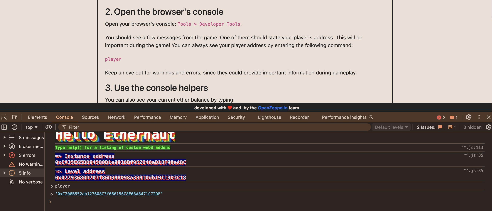
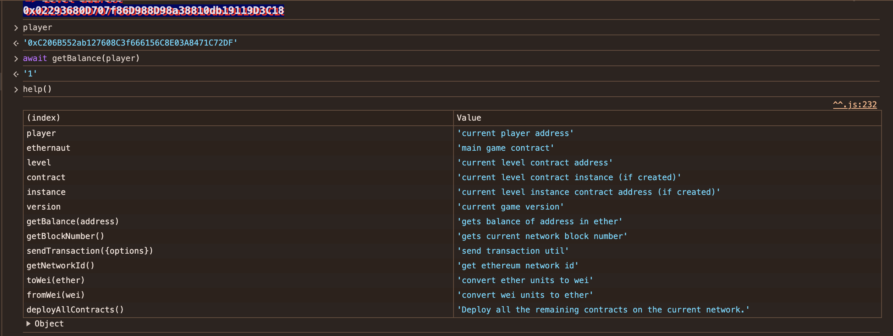
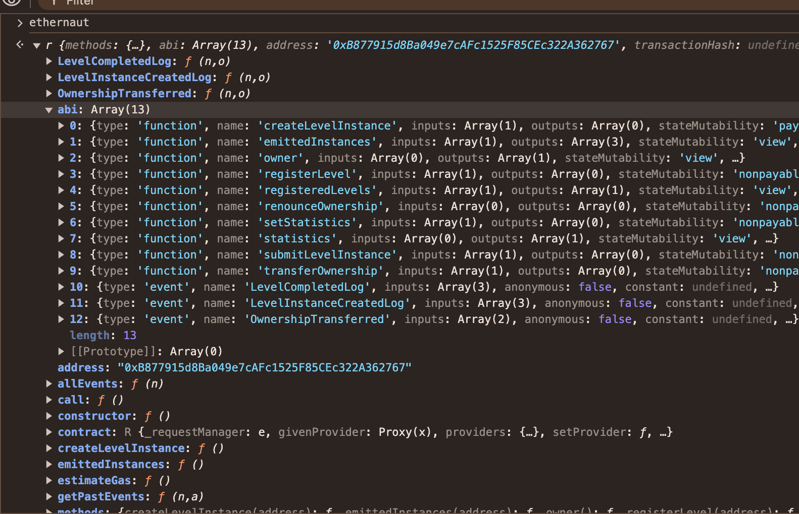
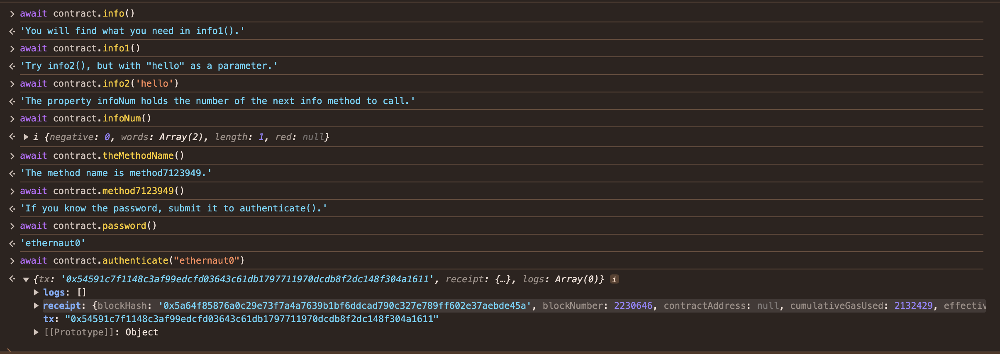
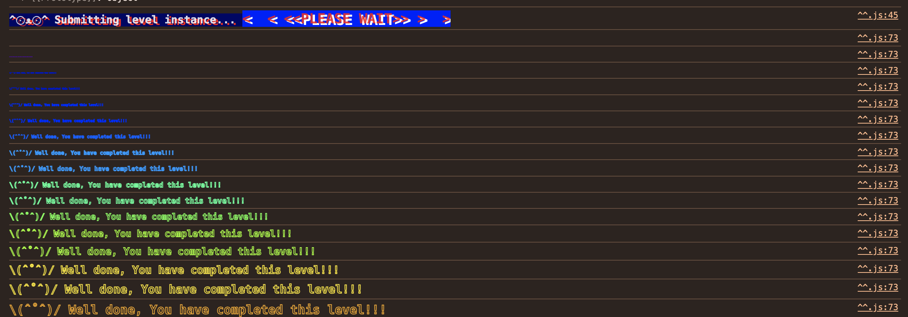

A-Ethernaut-CTF
------------------------
Day1 2024.09.29

1. 設定 MetaMask 環境，但我是安裝 Rabby 選擇 holesky 網路。

利用 
https://cloud.google.com/application/web3/faucet/ethereum/holesky 

取得測試網路的 ETH。

2.看一下玩家依照指令 開啟瀏覽器的控制台： Tools > Developer Tools 。

練習指令

3. 輸入 ethernaut 看控制的合約

4. 按照指令打
  
  

5. submint level  完成！

