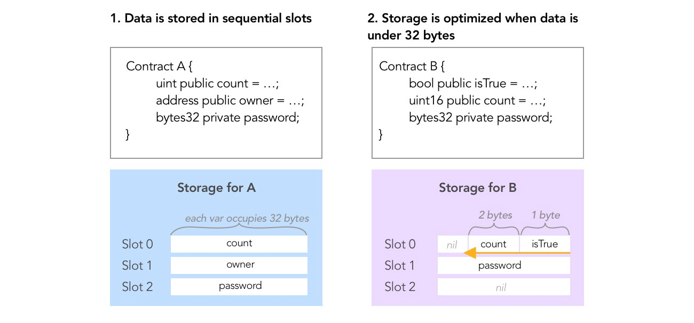

A-Ethernaut-CTF
------------------------

Day7 2024.09.05

Vault
------------------------

題目：

Unlock the vault to pass the level!

解鎖金庫 啾咪～！

```solidity
// SPDX-License-Identifier: MIT
pragma solidity ^0.8.0;

contract Vault {
    bool public locked;
    bytes32 private password;

    constructor(bytes32 _password) {
        locked = true;
        password = _password;
    }

    function unlock(bytes32 _password) public {
        if (password == _password) {
            locked = false;
        }
    }
}
```

解題：

  要看 Vault 是否解鎖就是要過

  `if(password == _password)` 這個條件，所以只要知道 password 就可以解鎖。

  從表面上 password 是 private 無法直接透過合約取得，但那是“人”的限制，合約是可以透過其他方式取得的。

  我們知道 solidity 是運行在 EVM 上的，所以只要編譯成 bytCode 都是有跡可循的。

  可以看下面的圖就可以明白一行是 32 bytes，所以 password 是在第二行的第一個 bytes32。

  

  想想看就是一個取 32 bytes 截斷轉換人看得懂的字串就可以了。（自己的理解）

  重點：
  `bytes32 storedPassword = vm.load(address(_vault), bytes32(uint256(1)));`

  對於結構的位子就是 `bytes32(uint256(1))`，這樣就可以取得 password 了。

  P.S. `bytes32(uint256(0))` 取得的是 locked 的值。

  POC:[Vault.t.sol](../A-Ethernaut-CTF/POC/test/8/Vault.t.sol)