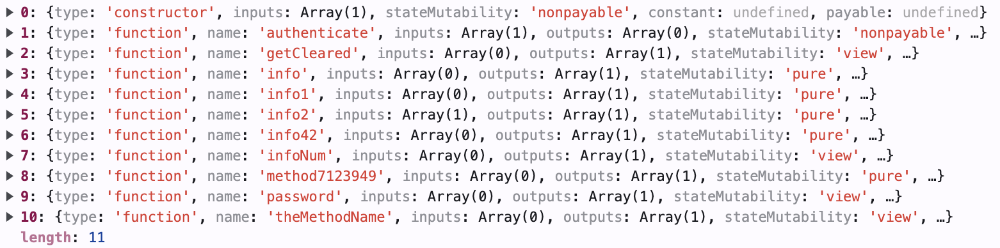
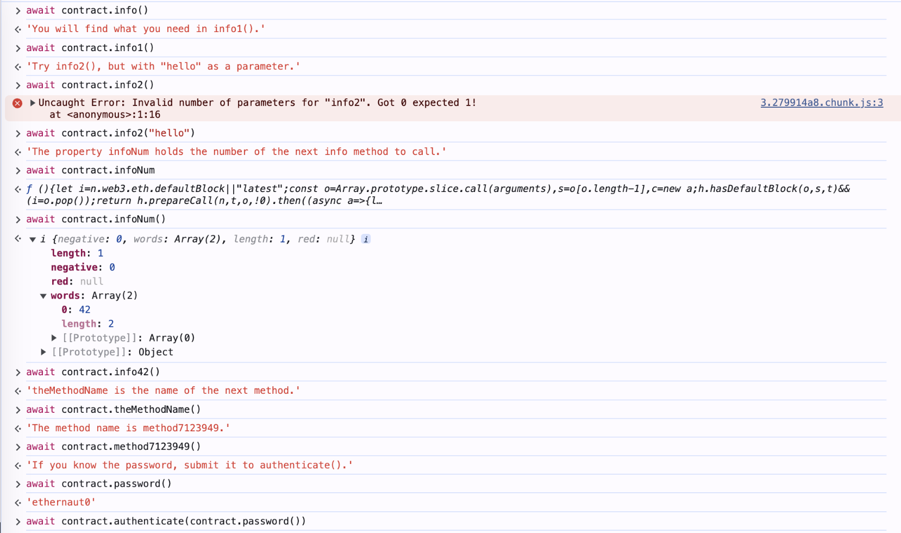

# 0 - Hello Ethernaut writeup

## 題目
[Hello Ethernaut](https://ethernaut.openzeppelin.com/level/0x7E0f53981657345B31C59aC44e9c21631Ce710c7)

## 筆記
題目一開始會先介紹一下怎麼用瀏覽器的網頁開發者工具跟合約互動，和怎麼啟動關卡實例。等啟動後就可以透過`contract.abi()`觀看合約的function，如下：



> [!NOTE]
> ABI (Application Binary Interface) 定義函式的介面，包含這些[欄位](https://gist.github.com/Ankarrr/f3f4173316223337696ea4c904e968ac)，可以幫助開發者了解怎麼跟這支合約互動

看完ABI以後，題目要求先從`info()`開始，function return的內容就是說下一步怎麼做，都蠻直覺的，一路操作都最後就可以成功完成這題了。附截圖：



提交之後，等待一下就會通知通關成功了。成功後會秀出這支合約的原始碼。針對這題的一些重點程式碼重新理一下題目：

``` Solidity
// SPDX-License-Identifier: MIT
pragma solidity ^0.8.0;

contract Instance {
    string public password;
    bool private cleared = false;
    
    // constructor
    constructor(string memory _password) {
        password = _password;
    }
		
    function authenticate(string memory passkey) public {
        if (keccak256(abi.encodePacked(passkey)) == keccak256(abi.encodePacked(password))) {
            cleared = true;
        }
    }
}
```
1. 13 行的 function `authenticate()` 是解開這題的主要函式，會檢查參數跟`password`是否相同
2. 第 9 行的 `constructor` 是只有合約建立時才會執行的function，`password`也是在這邊被賦予值的；也就是說該值是在合約成立時就設定好的。
3. 回到第 5 行，發現`password`這個變數在宣告時被設定為`public`。代表我們可以直接呼叫`password()`取得該值並通過`authenticate()`的判定。

> [!NOTE]
> 在Solidity中，宣告為`public`的變數會自動生成一個跟變數同名的getter function，也就代表任何人都可以讀取該變數。
