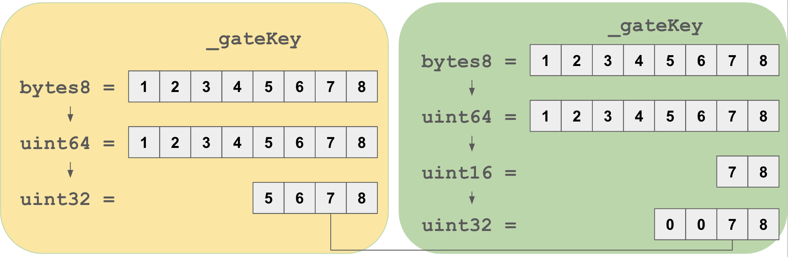
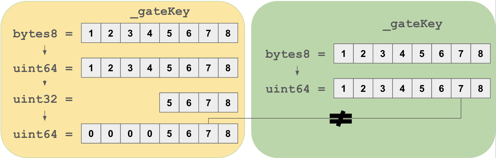
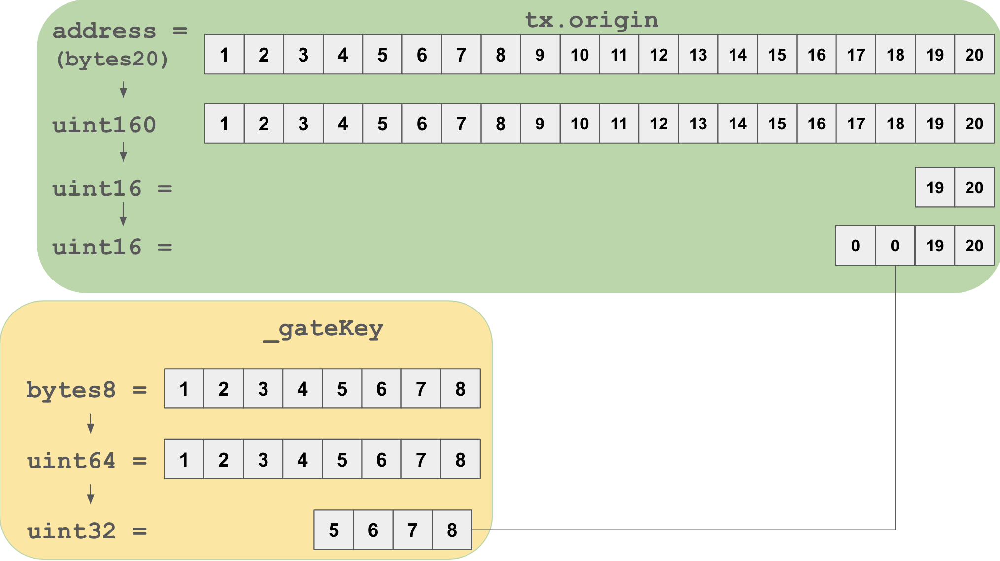

# 13 - Gatekeeper One

## 題目
[Gatekeeper One](https://ethernaut.openzeppelin.com/level/0xb5858B8EDE0030e46C0Ac1aaAedea8Fb71EF423C)

### 通關條件
1. 跨越守衛的守衛並且註冊成為參賽者吧。

### 提示
1. 回憶一下你在 Telephone 和 Token 關卡學到了什麼
2. 可以去翻翻 Solidity 文件，更深入的了解一下 `gasleft()` 函式的資訊 (參見 [Units and Global Variables](https://docs.soliditylang.org/en/v0.8.3/units-and-global-variables.html) 和 [External Function Calls](https://docs.soliditylang.org/en/v0.8.3/control-structures.html#external-function-calls)).

## 筆記
- `gasleft()` 可以用於確認目前操作後剩餘的gas數量避免gas不足導致交易失敗
- 這題是我目前解到最難的了，應該說是有很多過關條件，這題的攻擊合約要達成：
  1. GateOne: `require(msg.sender != tx.origin)` 這條件在 [04 Telephone](./04_Telephone.md) 就有實現過，不難達成
  2. GateTwo: `require(gasleft() % 8191 == 0)`， 它規定我們剩餘的合約要可以被 8191 整除，這我想好久我一直以為要把每個 function 的 gas 算出來，結果去看了別人的 PoC 才發歉只要爆破就好了，果然解題的重點就是過關就對了🤣
  3. GateThree:
      1. `require(uint32(uint64(_gateKey)) == uint16(uint64(_gateKey)))`，這邊再度考到 casting 的觀念，在 [12 Privacy 的 writeup](./12_Privacy.md) 有提到，這種形態轉換的觀念就是記得“型態變小左邊丟棄，不同型態比較以比較大的為主”就對了，這邊我都配上圖片方便一看就知道條件是什麼：
      
      第一個條件就是 `_gateKey` 的最後 4 bytes 要一樣，那因為右邊的型態轉換會把第 5, 6 byte 丟棄，最後比較的時候會補 0，為了達成條件我們要讓 `_gateKey` 的第 5, 6 byte 一開始就是 0，這樣就可以符合條件。
      2. 第二個條件：
      
      第二個條件是要不相等，那透過圖片可以看出來只要 `_gateKey` 的初始值在 1-4 byte 有值就可以達到這個效果，因為左邊會被丟棄後補 0，所以會不一樣。
      3. 第三個條件：
      
      第三個條件其實跟第一條很像，就是倒數 3, 4 byte 要是 0 就可以符合，但這邊額外的是其中一邊比較的變數是 `tx.origin` ，也就是我們的地址。
      
      綜合上面三個條件也就是說 `_gateKey` 要等於 `tx.origin` 且倒數 3, 4 byte 要是 0。這邊只要透過 AND 運算，就像濾波器一樣把不要的部份過濾掉就可以得到符合三個條件的值了：
      ``` solidity
      bytes8(uint64(uint160(tx.origin))) & 0xFFFFFFFF0000FFFF
      ```
  再統整一次三個 Gate 的通過實現方式:
  1. 呼叫另一個合約去攻擊
  2. 使用迴圈不斷測試送出多少 gas 會剛好被整除
  3. `_getKey = bytes8(uint64(uint160(tx.origin))) & 0xFFFFFFFF0000FFFF`
