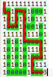

逻辑是迷宫，将坐标移动到终点即可过关。但受 [yul 优化器 bug](https://soliditylang.org/blog/2023/11/08/verbatim-invalid-deduplication-bug/) 的影响，向上和向下移动的代码块被错误的合并，如下所示，有两个条件都跳转到了 `0x18e` 向下移动的代码块。

```
    0x8: CALLER    
    0x9: DUP1      
    0xa: PUSH20    0xf9a2c330a19e2fbfeb50fe7a7195b973bb0a3be9
   0x1f: EQ        
   0x20: PUSH2     0x18e
   0x23: JUMPI     
   0x24: DUP1      
   0x25: PUSH20    0x2acf0d6fdac920081a446868b2f09a8dac797448
   0x3a: EQ        
   0x3b: PUSH2     0x19d
   0x3e: JUMPI     
   0x3f: DUP1      
   0x40: PUSH20    0x872917cec8992487651ee633dba73bd3a9dca309
   0x55: EQ        
   0x56: PUSH2     0x18e
   0x59: JUMPI     
   0x5a: PUSH20    0x802271c02f76701929e1ea772e72783d28e4b60f
   0x6f: EQ        
   0x70: PUSH2     0x180
   0x73: JUMPI     
```

因此向上移动只能使用后面的两次任意移动逻辑。而向上移动恰好只需要两次。



因此直接按上面的路径移动即可。

```solidity
// SPDX-License-Identifier: Unlicense
pragma solidity ^0.8.20;

import "./utils/BaseTest.sol";
import "./utils/Utilities.sol";
import "src/Challenge.sol";

contract TestSolver is BaseTest {
    Challenge private chal;
    address target;
    address w;
    address a;
    address s;
    address d;
    constructor() {
    }

    function setupChallenge() public {
        chal = new Challenge();
        target = chal.target();
        w = 0xF9A2C330a19e2FbFeB50fe7a7195b973bB0A3BE9;
        a = 0x2ACf0D6fdaC920081A446868B2f09A8dAc797448;
        s = 0x872917cEC8992487651Ee633DBA73bd3A9dcA309;
        d = 0x802271c02F76701929E1ea772e72783D28e4b60f;
        vm.label(w, "w");
        vm.label(a, "a");
        vm.label(s, "s");
        vm.label(d, "d");

    }

    function testSolve() public {
        run();
        assertTrue(chal.isSolved(), "Not solved.");
    }

    function run() public {
        setupChallenge();
        string memory sol_str = "sdssddwwddssssddddssaassddd";
        bytes memory sol = bytes(sol_str);

        for (uint i = 0; i < sol.length; i++) {
            if (sol[i] == "s") {
                vm.prank(s);
                target.call("");
            }
            if (sol[i] == "d") {
                vm.prank(d);
                target.call("");
            }
            if (sol[i] == "w") {
                // do not use vm.prank(w);
                target.call("0");
            }
            if (sol[i] == "a") {
                vm.prank(a);
                target.call("");
            }
        }
    }
}
```

