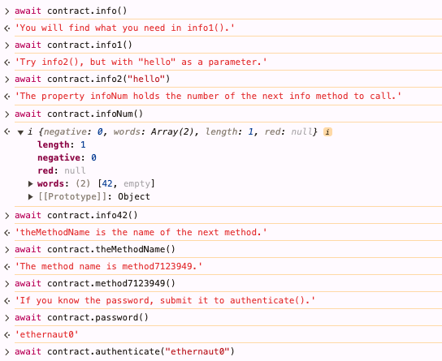

# 0 - Hello Ethernaut writeup

## 题目
[Hello Ethernaut](https://ethernaut.openzeppelin.com/level/0x7E0f53981657345B31C59aC44e9c21631Ce710c7)

## 笔记 
通过一系列练习，让学习者学会与项目互动的独特模式，解题过程如下
)

算是个热身练习，明天开始才是重头戏，对我也是，先跑通了本次残酷学习的流程。