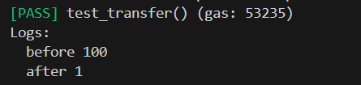
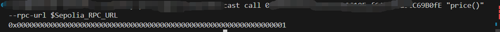

# Foundry 通关 Ethernaut（20）— Shop

参加残酷共学打卡活动，记录一下这段时间的收获

## 目标

以低于 price 的价格买到东西

## 漏洞合约

先来看漏洞合约本身，简单概括其核心功能：

1. **Buyer** :  一个接口，购买者合约必须实现 price 出价函数，这个函数返回一个出价值
2. **状态变量**：初始价格 price 为 100，是否卖出的标志布尔值 isSold
3. **buy** :
   1. 实例化一个购买者合约（从这里看这个合约应该是给外部合约调用的函数，因为 msg.sender 应该是合约地址）
   2. 如果 _buyer 合约的 price 出价函数值大于初始出价且商品并未售出，则更新售出状态，且价格为 _buyer 合约的 price 返回的出价

```solidity
// SPDX-License-Identifier: MIT
pragma solidity ^0.8.0;

interface Buyer {
    function price() external view returns (uint256);
}

contract Shop {
    uint256 public price = 100;
    bool public isSold;

    function buy() public {
        Buyer _buyer = Buyer(msg.sender);

        if (_buyer.price() >= price && !isSold) {
            isSold = true;
            price = _buyer.price();
        }
    }
}
```

## 思路

这里很明显需要我们去构造一个具有 price 函数的攻击合约。

对于 buy 函数，我们可以看到，他调用了两次 price 函数去获取买家的出价，类比 **Elevator** 那道题，我们可以尝试去构造一个两次调用返回不一样的值的函数，来绕过最开始的价格检查。

例如：由于 isSold 在条件检查后更新，我们可以根据 isSold 的状态来更换 price 返回值

（或者也可以根据调用次数，定义一个计数器来限制）

## foundry 复现

### 测试

1. 测试脚本

   ```solidity
   // SPDX-License-Identifier: UNLICENSED
   pragma solidity ^0.8.13;
   
   import {Test, console} from "forge-std/Test.sol";
   import {Shop,Attack} from "../src/Shop.sol";
   
   contract ShopTest is Test {
       Shop public shop;
       Attack public attack;
       address public attacker = vm.addr(456);
   
       function setUp() public {
           shop = new Shop();
           vm.prank(attacker);
           attack = new Attack(address(shop));
       }
   
       function test_transfer() public {
           console.log("before",shop.price());
           vm.prank(attacker);
           attack.attack();
           console.log("after",shop.price());
       }
   }
   ```

2. 终端输入

   ```solidity
   forge test --match-path test/Shop.t.sol
   ```

   

我们可以看到，攻击后，成功的修改 price 为 低于初始出价的值，也就是以更低的价格买到了东西

### 链上交互

1. 交互脚本

   ```solidity
   // SPDX-License-Identifier: UNLICENSED
   pragma solidity ^0.8.13;
   
   import {Script, console} from "forge-std/Script.sol";
   import {Shop,Attack} from "../src/Shop.sol";
   
   contract ShopScript is Script {
       Shop public shop;
       Attack public attack;
   
       function setUp() public {
           shop = Shop("关卡实例地址");
       }
       function run() public {
           vm.startBroadcast();
           attack = new Attack("关卡实例地址");
           attack.attack();
           vm.stopBroadcast();
       }
   }
   ```

2. 终端部署

   ```bash
   forge script script/Shop.s.sol --rpc-url $Sepolia_RPC_URL --broadcast --account [accountName] interactive
   ```

3. 查看合约数据

   ```solidity
   cast call [关卡实例地址] "price()" --rpc-url $Sepolia_RPC_URL
   ```

   

   我们可以看到 attack后的出价为 1，不是最初的出价 100


