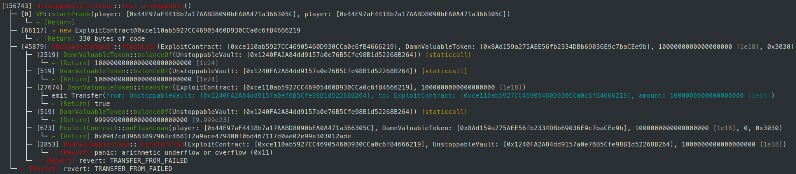
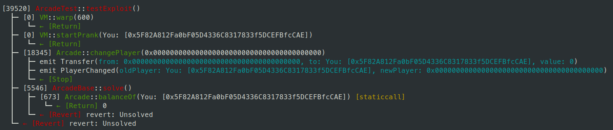

# Mystiz

1. 自我介紹

Software Engineer @google. CTF since 2017. Blog [here](https://mystiz.hk/about-me/).

2. 你認為你會完成本次殘酷學習嗎？

Can't say yes, but I hope this could get me motivated.

## Notes

<!-- Content_START -->

### 2024.08.28

1. 設定 Foundry 環境。https://book.getfoundry.sh/getting-started/installation
2. 把 Damn Vulnerable DeFi、EthTaipei CTF 2023 跟 MetaTrust CTF 2023 的題目先打包下來備用。
    * 把 EthTaipei CTF 2023 的答案刪掉。
    * MetaTrust CTF 2023 repo 要轉換成 Foundry 的模式，到解題的時候再把它們轉換過去。

目標：完成 Damn Vulnerable DeFi + EthTaipei CTF 2023 及 MetaTrust CTF 2023。

> [!NOTE]
> 2024.09.07：我覺得能不看題解做完 Damn Vulnerable DeFi 已經很足夠了...

### 2024.08.29

Progress

* Damn Vulnerable DeFi (2/18)
* EthTaipei CTF 2023 (0/5)
* MetaTrust CTF 2023 (0/22)

#### 📚 Reading: EIP for Flash Loans

Reference: https://eips.ethereum.org/EIPS/eip-3156

> A flash loan is a smart contract transaction in which a lender smart contract lends assets to a borrower smart contract with the condition that the assets are returned, plus an optional fee, before the end of the transaction.

#### 🔨 Foundry debugging

```solidity
pragma solidity =0.8.25;

import {IERC3156FlashBorrower} from "@openzeppelin/contracts/interfaces/IERC3156.sol";

contract ExploitContract is IERC3156FlashBorrower {
    function onFlashLoan(
        address initiator,
        address token,
        uint256 amount,
        uint256 fee,
        bytes calldata data
    ) external override returns (bytes32) {
        // Take the money from receiver
        

        return keccak256("IERC3156FlashBorrower.onFlashLoan");
    }
}
```

```bash
# We can use -vvvv to make the log super-verbose
forge test --match-test test_unstoppable -vvvv
```

This is what it looks when `vault.flashLoan(exploit, address(token), 1e18, bytes("00"));` is called, when my exploit contract is given above.



#### 🏁 Damn Vulnerable DeFi: Unstoppable

**Time used: ~1h 55m**

The goal of the challenge is to pause the vault. One way to trigger is to make the `vault.flashLoan` raise an exception -- thus the vault will be stopped when `isSolved` is called.

```solidity
try vault.flashLoan(this, asset, amount, bytes("")) { /* omitted */ } catch { /* pauses the vault here! */ }
// called in src/unstoppable/UnstoppableMonitor.sol:checkFlashLoan(100e18) (line 41)
// called in test/unstoppable/Unstoppable.t.sol:_isSolved() (line 106)
```

To make this happen, we can make `convertToShares(totalSupply) != balanceBefore`. In that's the case, the transaction will be reverted -- and thus raising an exception. We can simply transfer 1 DVT to the vault to halt the contract.

#### 🏁 Damn Vulnerable DeFi: Naive Receiver

**Time used: ~5h 35m**

The goal of the challenge is to drain the WETH from the `NaiveReceiverPool` and the `FlashLoanReceiver` contracts (which initially had 1000 WETH and 10 WETH).

Ideas:

1. We can call `pool.flashLoan(receiver, address(weth), 0, bytes(""));` and it will take 1 WETH away from `FlashLoanReceiver` each time.
1. We can use `BasicForwarder` to make `_msgSender()` to be the `NaiveReceiverPool`. However, it will always append `request.from` (you need its private key). We can bypass by calling `Multicall.multicall` from `BasicForwarder.execute`. In that way, the appended `request.from` will not be used.

### 2024.08.30

Progress

* Damn Vulnerable DeFi (4/18)
* EthTaipei CTF 2023 (0/5)
* MetaTrust CTF 2023 (0/22)

#### 🏁 Damn Vulnerable DeFi: Truster

**Time used: ~1h 40m**

The goal of the challenge is to drain the token from `TrusterLenderPool`. Additionally `flashLoan` is protected by the re-entrancy guard.

Function definition for `Address.functionCall`: https://github.com/OpenZeppelin/openzeppelin-contracts/blob/release-v5.1/contracts/utils/Address.sol#L62-L64

Since `token` is a ERC20 token, why not use the `approve` method? This allows our attacking contract to spend money on behalf of the pool, thus we can transfer funds out of the pool afterwards.

#### 📚 Reading: Re-entrancy attack

References:

- https://medium.com/mr-efacani-teatime/%E9%96%92%E8%81%8A%E5%8A%A0%E5%AF%86%E8%B2%A8%E5%B9%A3%E6%9C%80%E6%99%AE%E9%81%8D%E7%9A%84%E6%94%BB%E6%93%8A%E6%89%8B%E6%B3%95-re-entrancy-attack-ea63e90da7a7
- https://solidity-by-example.org/hacks/re-entrancy/
- https://github.com/pcaversaccio/reentrancy-attacks?tab=readme-ov-file (⭐ Collection of re-entrancy attacks)

#### 🏁 Damn Vulnerable DeFi: Side Entrance

**Time used: ~45m**

We create an `ExploitContract` to drain the funds from `SideEntranceLenderPool`. To start with, we call `flashLoan` to get 1000 ETH. We then deposit the money to the pool. Since the pool's balance is unchanged, it is considered repayed. The only difference is, we have 1000 ETH deposited to the pool.

After that, we can simply withdraw the amount to the recovery wallet.

### 2024.08.31

Progress

* Damn Vulnerable DeFi (5/18)
* EthTaipei CTF 2023 (0/5)
* MetaTrust CTF 2023 (0/22)

#### 🏁 Damn Vulnerable DeFi: The Rewarder

**Time used: ~1h 15m**

Important: We are also rewarded. `0x44E97aF4418b7a17AABD8090bEA0A471a366305C` appeared on line 755 in both files. We are the 188th entry.

To (almost) drain the reward distributor, we can repeatedly send the same claim in the same transaction. This is because `_setClaimed` will be called once.

### 2024.09.01

#### 📚 Reading: ERC20 votes?

Preparation for _Damn Vulnerable DeFi: Selfie_... Maybe?

- https://www.rareskills.io/post/erc20-votes-erc5805-and-erc6372
- https://docs.openzeppelin.com/contracts/4.x/api/token/erc20#ERC20Votes


### 2024.09.02

Progress

* Damn Vulnerable DeFi (6/18)
* EthTaipei CTF 2023 (0/5)
* MetaTrust CTF 2023 (0/22)

#### 🏁 Damn Vulnerable DeFi: Compromised

**Time used: ~45m**

The two lines in README.md corresponds to the first two private keys of the trusted accounts:

```plaintext
0x7d15bba26c523683bfc3dc7cdc5d1b8a2744447597cf4da1705cf6c993063744
0x68bd020ad186b647a691c6a5c0c1529f21ecd09dcc45241402ac60ba377c4159
```

Therefore, we can control the price by updating the median. Since we have 2 out of 3 trusted accounts compromised, it is easily achievable.

We can follow the procedures to drain the pool:

1. Update the price of the NFT to 0.1 ETH and buy it.
2. Update the price of the NFT to 999.1 ETH and sell it. We will gain 999 ETH here.
3. Update the price of the NFT to 999 ETH, pretending that nothing has happened.

### 2024.09.03

Progress

* Damn Vulnerable DeFi (6/18)
* EthTaipei CTF 2023 (1/5)
* MetaTrust CTF 2023 (0/22)

#### 🏁 EthTaipei CTF 2023: Arcade 🤯

**Time used: ~35m**

If we call `arcade.changePlayer(address(0x0));`, we can see that the event `Transfer` is called before `PlayerChanged`. Thus we are able to steal other's account by transferring the current player to the victim.



From _Solidity Underhanded Contest 2022_, [a submission](https://github.com/ethereum/solidity-underhanded-contest/blob/master/2022/submissions_2022/submission9_TynanRichards/SPOILERS.md) mentioned that the parameters had a bizarre evaluation order:

1. the _indexed_ parameters will first be evaluated right-to-left;
2. the non-indexed parameters will then be evaluated left-to-right.

In our case, `newPlayer` will be evaluated earlier than `oldPlayer` in `event PlayerChanged(address indexed oldPlayer, address indexed newPlayer);`. Hence, the actual behaviour of the `changePlayer` function being:

1. sets the current player to `newPlayer`
2. redeems the current player's (`newPlayer`'s) score to the sender (us).

Therefore we are able to steal 190 PRIZE. If we call `.earn` and `.redeem` before we exploit, we will be able to loot for another 10 PRIZE.

### 2024.09.04

Progress

* Damn Vulnerable DeFi (6/18)
* EthTaipei CTF 2023 (2/5)
* MetaTrust CTF 2023 (0/22)

#### 🏁 EthTaipei CTF 2023: NFT

**Time used: ~1h 15m**

Re-entrance attack: During `withdraw`, the NFT is _first_ transferred from the pool to our address then decreases the `_balances[msg.sender]`. Also `onERC721Received` on the receipient's contract will be called.

We can make `onERC721Received` to transfer (not deposit) the NFT, then withdraw that immediately. This heuristic should be called only once.

In that case, `_balances[msg.sender] -= 1 ether` will be executed twice. For Solidity < 0.8, SafeMath is required to prevent integer overflows -- and it isn't used. Therefore, we eventually have `_balances[msg.sender] == uint256(-1 ether)`.

### 2024.09.06

#### 🏳️ Damn Vulnerable DeFi: Climber

**Time used: 5h 30m and ongoing...**

#### 📚 Reading: ERC1967 - Universal Upgradeable Proxy Standard (UUPS)

https://hackmd.io/@KryptoCampDev/Web3-Proxy-Contract?utm_source=preview-mode&utm_medium=rec#ERC1967

### 2024.09.07

Progress

* Damn Vulnerable DeFi (7/18)
* EthTaipei CTF 2023 (2/5)
* MetaTrust CTF 2023 (0/22)

#### 🏁 Damn Vulnerable DeFi: Climber

**Time used: ~6h 20m**

The vulnerability comes from `ClimberTimelock.execute`. The "ready for execution" check comes after the user-provided functions are called.

The goal is to find a way to make `getOperationState(id)` to be `OperationState.ReadyForExecution`. Otherwise, the entire call will be reverted and the exploit will be useless.

I thought of something like making keccak256(abi.encode(...))` returning the same values of two items, but that would require either (1) hash collision, or (2) ambiguity from `abi.encode`. Of course that wouldn't be (1), and (2) is not doable according to https://ethereum.stackexchange.com/questions/113188/can-abi-encode-receive-different-values-and-return-the-same-result.

Eventually, I created a contract (took me so long to figure out) that enrolls the proper parameters to `ClimberTimelock.schedule`. Also, we would need to make the exploit contract an admin/proposer; and to update the delay to zero for immediate action.

With the exploit contract promoted to an admin, we can upgrade `ClimberVault` and inject a function to drain the tokens in the vault.

### 2024.09.08

Progress

* Damn Vulnerable DeFi (8/18)
* EthTaipei CTF 2023 (2/5)
* MetaTrust CTF 2023 (0/22)
* OnlyPwner.xyz (7/16)

#### 🏁 Damn Vulnerable DeFi: Shards

**Time used: ~45m**

A vulnerability here being, when one fills a offer, the price is rounded down. On the other hand, when an offer is cancelled, the price is rounded up.

Additionally, it is possible to fill the first offer with 133 shards for free. Cancelling the offer, one could steal 9.975e-6 DVT. We can buy more shards and generate more benefits afterwards.

#### 🏁 OnlyPwner.xyz

> [!WARNING]
> No public writeups allowed, but I finished _Freebie_ (~1h 40m), _Tutorial_ (~5m), _Reverse Rugpull_ (~15m), _Under the Flow_ (~35m) and _Please Sign Here_ (~15m), _All or Nothing_ (~1h 05m), _Multisig_ (~2h 15m).

### 2024.09.09

Progress

* Damn Vulnerable DeFi (8/18)
* EthTaipei CTF 2023 (2/5)
* MetaTrust CTF 2023 (0/22)
* OnlyPwner.xyz (9/16)

#### 🏁 OnlyPwner.xyz

> [!WARNING]
> Finished _Proof of Work_ (~1h 10m), _Payday_ (~1h 10m).

### 2024.09.10

#### 🏳️ OnlyPwner.xyz: Liquid Staking

**Time used: 2h 20m and ongoing...**

### 2024.09.11

#### 📚 Reading: Ethereum's Yellow Paper

#### 🏳️ OnlyPwner.xyz: Wrapped Ether

**Time used: 55m and ongoing...**

### 2024.09.12

#### 📚 Reading: Hacks in Solidity by Example

- https://solidity-by-example.org/hacks/re-entrancy/ (and the other pages)


#### 🏳️ OnlyPwner.xyz: 13th Airdrop

**Time used: 1h25m and ongoing...**

### 2024.09.13

Progress

* Damn Vulnerable DeFi (8/18)
* EthTaipei CTF 2023 (2/5)
* MetaTrust CTF 2023 (0/22)
* OnlyPwner.xyz (10/16)


#### 🎮 Playing: Foundry's debugger 🤩

```bash
forge debug --debug src/bridge-takeover/Bridge.sol --sig "voteForNewRoot(bytes)" "0x"
```

#### 🏁 OnlyPwner.xyz

> [!WARNING]
> Finished _Bridge Takeover_ (~2h 15m)... Finally a solve after few days.

### 2024.09.14

Progress

* Damn Vulnerable DeFi (8/18)
* EthTaipei CTF 2023 (2/5)
* MetaTrust CTF 2023 (0/22)
* OnlyPwner.xyz (11/16)

#### 🏁 OnlyPwner.xyz

> [!WARNING]
> Finished _13th Airdrop_ (~2h 15m).

### 2024.09.15

#### 🏳️ OnlyPwner.xyz: Liquid Staking

**Time used: 4h 30m and ongoing...**


<!-- Content_END -->

<!-- 

Stash

#### 🏁 Damn Vulnerable DeFi: Puppet

`calculateDepositRequired(amount)` is the amount of ETH required to lend `amount` in tokens. For instance, `calculateDepositRequired(1 ether)`

1. would be `2 ether` when `uniswapPair.balance == 10 ether` and `token.balanceOf(uniswapPair) == 10 ether`,
2. would be `1 ether` when `uniswapPair.balance == 10 ether` and `token.balanceOf(uniswapPair) == 20 ether`,
3. would be `4 ether` when `uniswapPair.balance == 20 ether` and `token.balanceOf(uniswapPair) == 10 ether`.

-->
