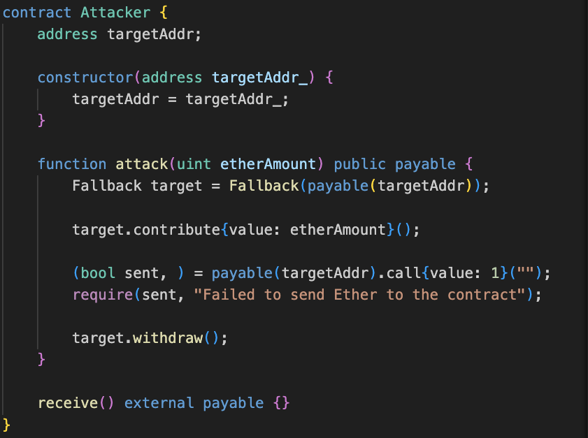
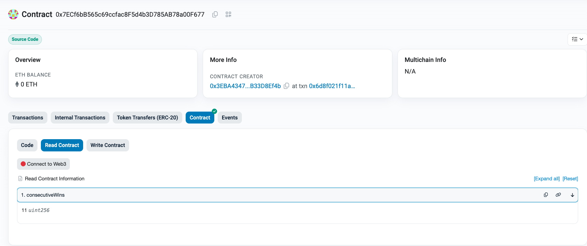

# phipupt

1. 自我介绍
   接触 web3 挺长时间了，一直浅尝则止，希望借这个机会深入学习下。
2. 你认为你会完成本次残酷学习吗？
   没问题

## Notes

<!-- Content_START -->

### 2024.08.29
The Ethernaut level 0
第一天打卡，内容比较简单，在控制台输入代码即可交互


### 2024.08.30
The Ethernaut level 1- 获取合约拥有权，并提取余额
只需要先调用 contribute 方法存入一笔资金，再转账任意数量 ether 带合约就可以获得 ownership，进而提取全部余额。
重新温习了 Foundry，写了个合约去调用。但是一直报错，还得再改改。


### 2024.08.31
The Ethernaut level 1

调试了好久，终于成功了。

在 sepolia 重新部署了一个 level01 的 `Fallback` [合约](https://sepolia.etherscan.io/address/0xF6a32a802127712efAAED091Fa946492460Cb703#code)。

写了一个攻击合约去实现所有功能，攻击合约在[这里](Writeup/phipupt/ethernaut/script/Level01.s.sol)。  
具体实现逻辑：
1. 先给攻击合约一定数量的 ether，用于调用 `Fallback` 合约时发送 ether
2. 调用 `attack` 方法，该方法调用 `Fallback` 合约的 `contribute` 方法，存入一笔资金。再直接发送 1 wei 给 `Fallback` 合约，从而获取 `owner` 权限。
3. 最后再调用 `Fallback` 合约的 `withdraw` 方法（此时已经具有 `owner` 权限），成功提取所有资金




### 2024.09.01
The Ethernaut level 2  

这道题的构造函数是 `Fal1out`，合约名叫 `Fallout`。不仔细检查，完全看不出来区别。

本题想考的知识点应该是：在 Solidity 0.4.22 之前，可以使用与合约同名的函数作为构造函数。从 Solidity 0.4.22 开始，应使用 `constructor` 关键字。

因此，破解这题没什么难度。“构造”函数并没有被执行，合约部署后 `owner` 没有被赋值，为默认值 `0x`。只要调用 `Fal1out` 函数即可获得 `owner` 权限。

下面是使用 Foundry 的 cast 命令去调用智能合约：

（新部署的 `Fallout` 合约，[地址](https://sepolia.etherscan.io/address/0x6c178efb9F79C13f88618F82Dee359025F3C8F71)）

合约部署后调用合约的 `owner` 方法，返回 `0x0000000000000000000000000000000000000000`。
```
cast call \
0x6c178efb9F79C13f88618F82Dee359025F3C8F71  "owner()(address)"  \
--rpc-url sepolia
```

调用 `Fal1out` 函数，获取 `owner` 权限。[交易哈希](https://sepolia.etherscan.io/tx/0xa5733b6b05d9bf1d444e55abda842a3e862df4d4a24c4475a97379d5463157fa)
```
cast send \
0x6c178efb9F79C13f88618F82Dee359025F3C8F71  "Fal1out()()"  \
--value 10000000000 \
--rpc-url sepolia \
--private-key <private key>
```

再次调用上面的 `owner` 方法，返回发送者地址 `0x3EBA4347974cF00b7ba130797e5DbfAB33D8Ef4b`。


### 2024.09.02
The Ethernaut level 3

这个挑战要求在一次投币游戏中通过猜测投币的结果连续正确10次。

为了在连续猜对10次，必须预测 `blockValue`，并在调用 `flip` 函数时提供正确的 `_guess` 参数。

基于以上的分析，可以设计如下步骤来连续正确猜测10次：

1. 部署一个新的合约(`Attacker`)，该合约能够计算并预测 `CoinFlip` 合约的投币结果。
2. 使用该合约调用 `CoinFlip` 合约的 `flip` 函数，这样每次都能提供正确的 `_guess` 参数。
3. 重复调用多次

示例合约在[这里](Writeup/phipupt/ethernaut/script/Level03.s.sol)

链上记录：
- level(`CoinFlip`) 新实例：https://sepolia.etherscan.io/address/0x7ECf6bB565c69ccfac8F5d4b3D785AB78a00F677
- attacker 合约：https://sepolia.etherscan.io/address/0xdce3c80980837bfb66524bc0ccf3d2f5db5ae8ff




### 2024.09.03
The Ethernaut level 4

Ethernaut的第4关要求获得合约的owner权限。

要获得owner权限，需要调用 `changeOwner` 方法，但条件是 `tx.origin != msg.sender`。

这个条件可以通过使用一个中间合约来绕过，通过中间合约去调用目标合约来实现。此时
- `tx.origin` = 发送交易者
- `msg.sender` = 中间合约地址

示例合约在[这里](Writeup/phipupt/ethernaut/script/Level04.s.sol)

链上记录：
- level(`Telephone`) 新实例：0x231014b0FEf1C0AF96189700a43221fACF1DfF7E
- attacker 合约：https://sepolia.etherscan.io/address/0xa380337b31833736daa3a044a41e5fb821d15128
- 可以使用 `cast call` 命令来调用目标合约的 `owner` 函数来获取 `owner` 地址。：
`cast call 0x231014b0FEf1C0AF96189700a43221fACF1DfF7E "owner()(address)" --rpc-url sepolia`

<!-- Content_END -->
